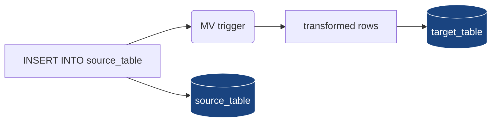

# Module 2 — Table Engines & Data Modelling

> **Audience:** anyone designing a ClickHouse schema. **Prerequisites:**
> Module 1 (parts, merges, MergeTree). **Time:** ~60 min reading + 30 min hands-on.

By the end you will be able to:

- Pick the right `*MergeTree` variant for any append/SCD/aggregation pattern.
- Read sign-collapse and version-collapse semantics.
- Design Materialized View pipelines that pre-aggregate at insert time.
- Use `Nested`, `Array`, `Map` to model 1-to-many without joins.
- Recognise when **not** to use a fancy engine.

---

## 1. The engine landscape at a glance

```
                      ┌───────────────────────────────────────┐
                      │             Storage engines            │
                      └──────────────┬────────────────────────┘
                                     │
       ┌─────────────────────────────┼──────────────────────────────────┐
       │                             │                                   │
       ▼                             ▼                                   ▼
  ┌─────────┐               ┌──────────────┐                     ┌───────────┐
  │ Log     │               │  MergeTree   │                     │ Special   │
  │ family  │               │  family      │                     │ engines   │
  └─────────┘               └──────┬───────┘                     └───────────┘
       │                            │                                   │
   ┌───┴────┐    ┌──────────────────┼────────────────────────┐    ┌────┴─────┐
   │        │    │                  │                        │    │          │
  Log    StripeLog              MergeTree              Replicated*    Memory   Buffer
       TinyLog                Replacing                                Dictionary  Distributed
                              Summing                                              Kafka / S3 / URL
                              Aggregating                                          Merge / View / MV
                              Collapsing
                              VersionedCollapsing
                              GraphiteMergeTree
```

| Family       | Use when                                                                                    | Don't use when                            |
|--------------|---------------------------------------------------------------------------------------------|-------------------------------------------|
| **Log**      | Tiny ad-hoc tables. No indexes, no parts. Atomic blocks but no resumable reads.             | Anything you care about losing.           |
| **MergeTree**| 99% of analytical tables. Default choice.                                                   | High-write, mutable, single-row workloads.|
| **Replicated\***| MergeTree variants on a cluster. Module 4 deep-dives.                                    | Single-node demos.                        |
| **Memory**   | Caches, ephemeral state, tests. Lost on restart.                                            | Anything that must survive a crash.       |
| **Buffer**   | Last-resort smoothing layer in front of MergeTree if you cannot batch upstream.             | If you can batch upstream — just batch.   |
| **Distributed** / **Kafka** / **MySQL** / **S3** | Federation engines. They don't store data — they read or fan-out.            | When you actually want a local table.     |

---

## 2. Plain `MergeTree` — the baseline

You already know it from Module 1. Recap:

- Append-only at the part level.
- Parts merge in the background; rows within a part are sorted by `ORDER BY`.
- No deduplication, no aggregation, no rollup. Just sort+compress+merge.

Use this until you have a *specific reason* to pick something else.

---

## 3. ReplacingMergeTree — slowly-changing dimensions

Same as MergeTree, but during merges, **rows with the same sort key are
collapsed into one**, keeping the row with the highest *version*.

```sql
CREATE TABLE users_replacing (
    user_id UInt64,
    name    String,
    email   String,
    version UInt64
)
ENGINE = ReplacingMergeTree(version)
ORDER BY user_id;
```

### Mental model

```
INSERT batch 1:                  INSERT batch 2:
┌──────┬───────┬──────────┬───┐  ┌──────┬───────┬──────────┬───┐
│ id=1 │ alice │ a@old    │ v1│  │ id=1 │ alice │ a@new    │ v2│
│ id=2 │ bob   │ b@old    │ v1│  │ id=3 │ carol │ c@new    │ v3│
└──────┴───────┴──────────┴───┘  └──────┴───────┴──────────┴───┘

After merge (same id collapses, highest version wins):

  ┌──────┬───────┬──────────┬───┐
  │ id=1 │ alice │ a@new    │ v2│
  │ id=2 │ bob   │ b@old    │ v1│
  │ id=3 │ carol │ c@new    │ v3│
  └──────┴───────┴──────────┴───┘
```

### Three ways to read

| Method                                                                | Latency          | Notes                                                                                       |
|-----------------------------------------------------------------------|------------------|---------------------------------------------------------------------------------------------|
| `SELECT * FROM t`                                                     | Fast (no merge)  | **Returns dupes** until merge runs. Almost never what you want.                            |
| `SELECT * FROM t FINAL`                                               | Slow (merges at read time) | Correct, but reads the whole partition. Avoid in hot paths.                       |
| `SELECT user_id, argMax(name, version), argMax(email, version), max(version) AS v FROM t GROUP BY user_id` | Fast | The production pattern. Works regardless of merge state. |

> **Key takeaway:** ReplacingMergeTree gives *eventual* dedup. If your
> query absolutely must see at most one row per key, do the dedup in the
> query (`argMax`), not via `FINAL`.

---

## 4. SummingMergeTree — pre-aggregated counters

Like MergeTree, but during merges, **rows with the same sort key get their
numeric columns summed**. Non-numeric columns from the row with the
*lowest* part get kept (treat them as the dimensions).

```sql
CREATE TABLE metrics_summing (
    metric_date Date,
    metric      LowCardinality(String),
    region      LowCardinality(String),
    value       UInt64,           -- summed
    count       UInt64 DEFAULT 1  -- summed
)
ENGINE = SummingMergeTree((value, count))
ORDER BY (metric_date, metric, region);
```

### Mental model

```
INSERT 1:                              INSERT 2:
(date, m, region, value, count)        (date, m, region, value, count)
('2026-05-01', 'cpu', 'us', 50, 1)    ('2026-05-01', 'cpu', 'us', 30, 1)
('2026-05-01', 'cpu', 'us', 20, 1)    ('2026-05-01', 'cpu', 'eu', 80, 1)

  After merge (sort-key duplicates summed):

  ('2026-05-01', 'cpu', 'us', 100, 3)
  ('2026-05-01', 'cpu', 'eu',  80, 1)
```

> **Read pattern:** still wrap in `sum(value)` / `sum(count)` even after
> SummingMergeTree, because the merge is incomplete until the next merge
> pass. The engine guarantees correct results *if you sum at read time*.

---

## 5. AggregatingMergeTree — non-additive aggregations

For aggregations that aren't simple sums (`uniq`, `quantile`, `avg`,
`max`), `Sum` won't work. Aggregating stores **partial aggregation states**
(`AggregateFunction(...)`) and finalises them at read time with `*Merge`.

```sql
CREATE TABLE events_agg (
    bucket_date       Date,
    country           LowCardinality(String),
    uniq_users_state  AggregateFunction(uniq, UInt32),
    revenue_state     AggregateFunction(sum, Float64),
    p99_state         AggregateFunction(quantileTDigest(0.99), Float64)
)
ENGINE = AggregatingMergeTree
ORDER BY (bucket_date, country);

-- Insert STATES (not raw values) — usually fed by a Materialized View:
INSERT INTO events_agg
SELECT
    bucket_date, country,
    uniqState(user_id),
    sumState(revenue),
    quantileTDigestState(0.99)(latency)
FROM raw_events
GROUP BY bucket_date, country;

-- Read: finalize with *Merge.
SELECT bucket_date, country,
       uniqMerge(uniq_users_state) AS uniq_users,
       sumMerge(revenue_state)     AS revenue,
       quantileTDigestMerge(0.99)(p99_state) AS p99
FROM events_agg
GROUP BY bucket_date, country;
```

> **Why not just store final values?** Because then you can't roll
> *across* buckets. `uniq` over (Mon ∪ Tue) ≠ `uniq(Mon) + uniq(Tue)`.
> Storing the state lets the engine merge correctly.

---

## 6. CollapsingMergeTree — current-state mutations

Designed for "delete or update by writing two rows": one with `sign = +1`
inserts, one with `sign = -1` cancels.

```sql
CREATE TABLE orders_collapsing (
    order_id UInt64,
    status   LowCardinality(String),
    total    Float64,
    sign     Int8
)
ENGINE = CollapsingMergeTree(sign)
ORDER BY order_id;

INSERT INTO orders_collapsing VALUES (101, 'pending', 10.0, +1);
-- Order 101 paid: cancel old row, write new row in one INSERT
INSERT INTO orders_collapsing VALUES
    (101, 'pending', 10.0, -1),
    (101, 'paid',    10.0, +1);
```

### How collapse works

```
Before merge:                     After merge:
┌────┬────────┬─────┬───┐         ┌────┬───────┬──────┬───┐
│101 │pending │10.0 │+1 │  ──►    │101 │paid   │10.0  │+1 │
│101 │pending │10.0 │-1 │         └────┴───────┴──────┴───┘
│101 │paid    │10.0 │+1 │
└────┴────────┴─────┴───┘
```

### Two reading patterns

```sql
-- Pattern A: trust the merge (eventual consistency)
SELECT * FROM orders_collapsing FINAL;

-- Pattern B: do it in the query (works pre-merge too)
SELECT order_id,
       argMax(status, sign) AS status,
       sum(total * sign)    AS total
FROM orders_collapsing
GROUP BY order_id;
```

> **Gotcha:** if `sign = -1` arrives without the matching `sign = +1`
> earlier, you get a *negative* row. The +1/-1 pair must be ordered with
> -1 *after* the +1 it cancels.

---

## 7. VersionedCollapsingMergeTree — out-of-order tolerant

CollapsingMergeTree breaks if events arrive out of order. **VersionedCollapsing**
adds a `version` column; the engine resolves on `(sort_key, version)`.

```sql
CREATE TABLE orders_versioned (
    order_id UInt64,
    status   LowCardinality(String),
    total    Float64,
    version  UInt64,    -- monotonic per order_id
    sign     Int8
)
ENGINE = VersionedCollapsingMergeTree(sign, version)
ORDER BY order_id;
```

The cancel rows can arrive *before* the inserts they cancel; the engine
sorts them out at merge time using `version`.

> **Use this** in any pipeline where event ordering isn't guaranteed
> (Kafka, multi-region producers, retry queues).

---

## 8. Log-family engines — when minimalism wins

| Engine    | Atomic INSERT | Indexes | Compressed | Concurrent reads | Use it for                      |
|-----------|---------------|---------|------------|------------------|---------------------------------|
| `Log`     | yes (block)   | no      | yes        | yes              | small append-only logs (audit)  |
| `TinyLog` | no            | no      | yes        | one at a time    | scratch tables (≤ 1M rows)      |
| `StripeLog` | no          | no      | yes        | yes              | medium tables; deprecated path  |

There's no `OPTIMIZE`, no merges, no skip-indexes. The engine is just
"appendable file". **Don't use Log-family for anything important.**

---

## 9. Memory engine — RAM-only

```sql
CREATE TABLE tmp_uploads (id UUID, payload String) ENGINE = Memory;
```

- Stored in process memory only. **Lost on restart.**
- Reads are fast; useful for caches, joins' right-hand side, or staging.
- No size cap by default — easy to OOM the server.

---

## 10. Buffer engine — last-resort write smoothing

A `Buffer` table sits in front of a real MergeTree and accumulates rows in
RAM until thresholds trigger a flush.

```sql
CREATE TABLE facts_dest (...) ENGINE = MergeTree ORDER BY (...);

CREATE TABLE facts_buffer AS facts_dest
ENGINE = Buffer(default, facts_dest,
    16,            -- num_layers
    10, 60,        -- min/max time (seconds)
    10000, 1_000_000,    -- min/max rows
    10_000_000, 100_000_000); -- min/max bytes
```

> **Strong recommendation:** prefer batching upstream. A Buffer table is
> a band-aid that *loses data on crash* — its rows haven't been written
> to MergeTree yet. Use it only when the producer literally cannot batch.

`OPTIMIZE TABLE facts_buffer;` flushes manually. Reading from the Buffer
table reads its in-memory layers + the destination table.

---

## 11. Materialized Views — the "computed table" pattern

In ClickHouse a Materialized View is **not a virtual view**. It's a real
table fed by a trigger that runs at INSERT time on a *source table*.



```sql
CREATE TABLE events_src (
    ts DateTime, user_id UInt64,
    event_type LowCardinality(String), revenue Float64
) ENGINE = MergeTree ORDER BY (event_type, ts);

CREATE TABLE events_per_minute (
    bucket DateTime, event_type LowCardinality(String),
    events UInt64, revenue Float64
) ENGINE = SummingMergeTree ORDER BY (bucket, event_type);

CREATE MATERIALIZED VIEW events_per_minute_mv TO events_per_minute AS
SELECT
    toStartOfMinute(ts) AS bucket, event_type,
    count() AS events, sum(revenue) AS revenue
FROM events_src
GROUP BY bucket, event_type;
```

| Property                          | Implication                                                                |
|-----------------------------------|-----------------------------------------------------------------------------|
| Triggers on **INSERT**, not UPDATE | Mutations don't propagate. Drop+recreate the MV to re-aggregate.          |
| One MV reads, multiple MVs allowed | A single source row can feed N MVs simultaneously.                        |
| `TO <table>` is the modern form    | Decouples MV definition from the storage engine. Always prefer it.        |
| MV must `GROUP BY` for *MergeTree variants | Otherwise the engine can't collapse correctly.                       |

> **Backfill pattern:** `INSERT INTO events_per_minute SELECT … FROM events_src GROUP BY …`
> after creating the MV — the MV won't see old rows on its own.

---

## 12. Nested type — 1-to-many without joins

`Nested` stores a "table inside a row" as parallel arrays.

```sql
CREATE TABLE invoices (
    invoice_id UInt64,
    customer   String,
    total      Decimal(12, 2),
    line_items Nested(
        sku   String,
        qty   UInt32,
        price Decimal(10, 2)
    )
) ENGINE = MergeTree ORDER BY invoice_id;

INSERT INTO invoices VALUES
    (1001, 'Alice', 49.97,
     ['SKU-A','SKU-B','SKU-C'], [1, 2, 1], [9.99, 14.99, 10.00]);
```

Two equivalent reading styles:

```sql
-- Dot-notation: get parallel arrays
SELECT invoice_id,
       line_items.sku, line_items.qty, line_items.price,
       arraySum(arrayMap((q, p) -> q * p, line_items.qty, line_items.price)) AS computed
FROM invoices;

-- ARRAY JOIN: explode to one row per item
SELECT invoice_id, sku, qty, price
FROM invoices
ARRAY JOIN line_items.sku AS sku, line_items.qty AS qty, line_items.price AS price;
```

> **Prefer Nested over JOINs** for tightly-bound 1-to-many like
> order-lines, page-impressions-per-session, or telemetry dimensions.
> JOINs in CH cost more than in OLTP databases.

---

## 13. The hands-on demo

### What you get

```
docker-compose.yml          m2-clickhouse · ports 8123/9000
configs/clickhouse-config.xml
setup.sql · data.sql · queries.sql · extras.sql
up.sh · run.sh · down.sh
```

### Execution flow — what runs, in order

| #  | Step          | What happens                                                                                                                                                                                              |
|----|---------------|-----------------------------------------------------------------------------------------------------------------------------------------------------------------------------------------------------------|
| 0  | self-bootstrap | If `m2-clickhouse` isn't healthy, run `up.sh` (which evicts other demo modules first to avoid port conflicts).                                                                                          |
| 1  | `setup.sql`   | Creates database `m2` and seven tables, one per engine: `users_replacing` (Replacing), `metrics_summing` (Summing), `events_agg` (Aggregating with `uniq`/`sum`/`quantileTDigest` states), `orders_collapsing` (Collapsing), `audit_log` (Log), `tmp_uploads` (Memory), `facts_dest` + `facts_buffer` (MergeTree + Buffer in front). |
| 2  | `data.sql`    | Loads each engine with shape-appropriate data: dupes for Replacing, partial counters for Summing, 200k aggregate STATES for Aggregating, +1/-1 sign rows for Collapsing, a few rows for Log/Memory/Buffer. |
| 3  | `queries.sql` | Walks each engine's reading pattern: dedup via `argMax`, `OPTIMIZE FINAL` reductions, `*Merge` finalizers for Aggregating, the +1/-1 collapse, and a Buffer flush via `OPTIMIZE TABLE m2.facts_buffer` to push rows down to `facts_dest`. |
| 4  | `extras.sql`  | Three more engines/patterns: **VersionedCollapsingMergeTree** (out-of-order +/-1 resolved by version), a complete **Materialized View pipeline** (`events_src` → `events_per_minute_mv` → `events_per_minute` SummingMergeTree, with 200k synthetic events), and the **Nested type** (`invoices.line_items.{sku, qty, price}`) queried with both dot-notation and `ARRAY JOIN`. |

---

## 14. Decision tree

```mermaid
flowchart TD
    Q1{Is the table append-only<br/>analytical data?} -- yes --> Q2
    Q1 -- "no, ad-hoc tiny" --> LOG[Log / TinyLog]
    Q1 -- "in-memory only" --> MEM[Memory]
    Q2{Need updates?} -- "no" --> MT[MergeTree]
    Q2 -- "yes, by replace" --> Q3
    Q2 -- "yes, by sum" --> SMT[SummingMergeTree]
    Q2 -- "yes, complex agg<br/>(uniq, quantile)" --> AMT[AggregatingMergeTree<br/>+ MV from raw table]
    Q2 -- "yes, by cancel/replace" --> Q4
    Q3{Out-of-order events?} -- "no" --> RMT[ReplacingMergeTree]
    Q3 -- "yes" --> RMT_V[ReplacingMergeTree(version)]
    Q4{Out-of-order events?} -- "no" --> CMT[CollapsingMergeTree]
    Q4 -- "yes" --> VCM[VersionedCollapsingMergeTree]

    style MT fill:#1a4480,stroke:#fff,color:#fff
    style RMT fill:#1a4480,stroke:#fff,color:#fff
    style SMT fill:#1a4480,stroke:#fff,color:#fff
    style AMT fill:#1a4480,stroke:#fff,color:#fff
    style CMT fill:#1a4480,stroke:#fff,color:#fff
    style VCM fill:#1a4480,stroke:#fff,color:#fff
    style RMT_V fill:#1a4480,stroke:#fff,color:#fff
```

---

## 15. Common pitfalls

| Symptom                                                                            | Cause                                                                              | Fix                                                                                            |
|------------------------------------------------------------------------------------|-------------------------------------------------------------------------------------|------------------------------------------------------------------------------------------------|
| `SELECT * FROM users_replacing` returns duplicates                                 | Merge hasn't run yet.                                                              | Use `argMax` query pattern; never rely on background merge for correctness.                    |
| `SELECT *` from SummingMergeTree returns multiple rows per key                     | Same — pre-merge state.                                                            | Always wrap with `sum(...)` at read time.                                                      |
| `Negative` rows in CollapsingMergeTree                                             | `sign=-1` arrived without matching `sign=+1`; or wrong sort key.                   | Verify your producer always emits `+1` then `-1`; or switch to VersionedCollapsing.            |
| AggregatingMergeTree rows look like garbage                                        | Forgot to `*Merge` at read time, or stored values instead of `*State`.             | Insert `xxxState(...)`, read `xxxMerge(...)`.                                                  |
| Buffer table silently drops rows on container restart                              | Buffer is in RAM. Crash = data loss.                                               | Don't use Buffer; batch upstream.                                                              |
| Materialized View misses historical data                                           | MV only triggers on INSERTs after creation.                                        | Backfill: `INSERT INTO target SELECT … FROM source GROUP BY …`.                                 |
| MV creates tons of tiny parts                                                      | Source has small frequent inserts.                                                 | Add a buffer or batch the source.                                                               |

---

## 16. Talking points for the live session

1. **MergeTree is the answer 80% of the time.** Show the decision tree
   and walk people through it.
2. **`FINAL` is a debugging convenience, not a production pattern.**
   Demonstrate by running `argMax` vs `FINAL` on the demo's
   `users_replacing` and showing query duration.
3. **Storing aggregation *state* unlocks rollups.** Show
   `uniqState` → `uniqMerge` over a week's data; `sum`-of-`uniq` would be wrong.
4. **Materialized Views are write-time triggers, not query-time views.**
   This is the single biggest ClickHouse misconception.
5. **Nested vs JOIN:** show the same query both ways, time them.
   Nested usually wins by 5–20×.

---

## 17. Container ports

| Service        | Container port | Host port |
|----------------|----------------|-----------|
| HTTP           | 8123           | 8123      |
| Native (TCP)   | 9000           | 9000      |
