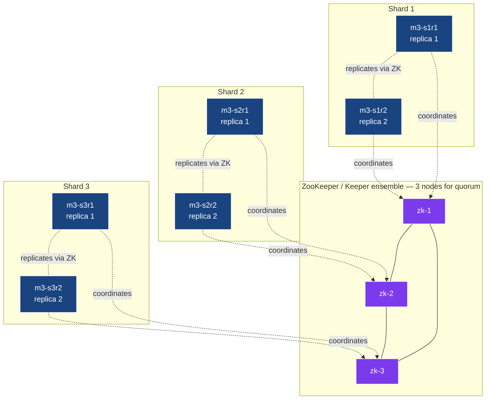
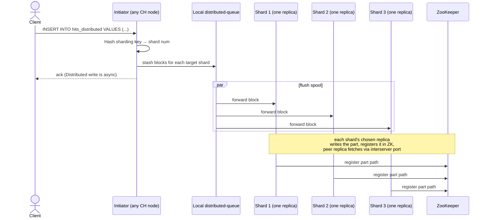
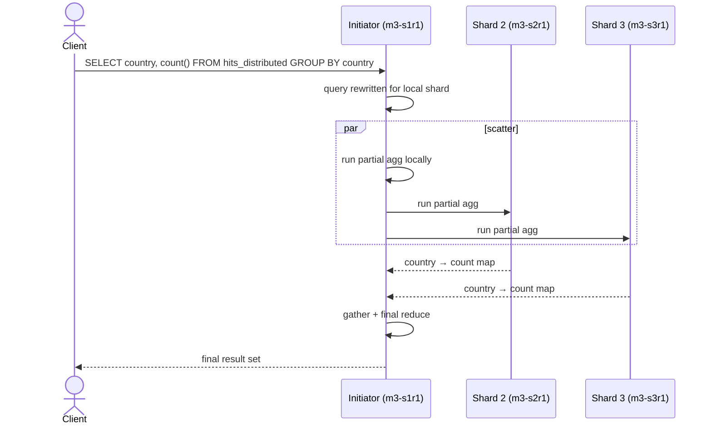

# Module 3 — Sharding & Distributed Tables

> **Audience:** anyone scaling ClickHouse beyond one node. **Prerequisites:**
> Modules 1–2. **Time:** ~75 min reading + 30 min hands-on.

By the end you will be able to:

- Read a `<remote_servers>` config and translate it into capacity.
- Pick a sharding key that gives even distribution *and* useful locality.
- Distinguish `internal_replication = true` vs `false` and know when to
  use each.
- Trace an INSERT through the Distributed engine to the right shard.
- Trace a SELECT through scatter→gather over a Distributed table.
- Use weighted shards to handle heterogeneous fleets.

---

## 1. Why shard?

A single ClickHouse node fits a remarkable amount of data — many teams
run a single-node setup well into the **multi-TB** range. You shard when:

| Reason                                | Symptom                                                         |
|---------------------------------------|-----------------------------------------------------------------|
| Data exceeds disk capacity            | `du -sh /var/lib/clickhouse` approaches the disk limit.          |
| Query CPU saturated on one box        | `system.metrics.Query` always at the thread limit.               |
| Background merges can't keep up       | `Too many parts` errors despite batched inserts.                 |
| Network ingress > one NIC             | INSERT throughput pegged at the NIC's line rate.                 |

If none of these are true: don't shard yet. A shard adds complexity to
DDL, queries, and operations.

---

## 2. The cluster shape used by every cluster module in this repo



**3 shards × 2 replicas = 6 ClickHouse processes + 3 ZooKeeper.** Every
shard's two replicas hold identical data. Different shards hold *different*
data, partitioned by the **sharding key**.

---

## 3. The two-table pattern

A sharded table is **two tables**, both created on every node:

| Table                   | Engine                  | Where                       | Purpose                                            |
|-------------------------|-------------------------|-----------------------------|----------------------------------------------------|
| `hits_local`            | `ReplicatedMergeTree`   | physical, on each replica   | Actually stores the rows.                          |
| `hits_distributed`      | `Distributed`           | logical, on each replica    | Fans inserts/reads across shards.                  |

```sql
-- Created ONCE with ON CLUSTER, materialised on every node.
CREATE TABLE hits_local ON CLUSTER clickhouse_cluster (
    event_time DateTime,
    user_id    UInt64,
    country    LowCardinality(String),
    bytes      UInt32
)
ENGINE = ReplicatedMergeTree(
    '/clickhouse/tables/{shard}/hits_local',  -- ZK path: per-shard
    '{replica}'                                -- replica id within the shard
)
PARTITION BY toYYYYMM(event_time)
ORDER BY (user_id, event_time);

CREATE TABLE hits_distributed ON CLUSTER clickhouse_cluster
AS hits_local
ENGINE = Distributed(
    'clickhouse_cluster',     -- cluster name from <remote_servers>
    default,                  -- target database
    hits_local,               -- target table
    cityHash64(user_id)       -- sharding key
);
```

**`{shard}` and `{replica}` are macros**, expanded per-node from
`configs/macros/macros-sNrM.xml` (Module 4 dives into this).

---

## 4. The cluster config — `<remote_servers>`

This is the source of truth for "what's a shard, what's a replica":

```xml
<remote_servers>
    <clickhouse_cluster>
        <shard>
            <internal_replication>true</internal_replication>
            <replica><host>m3-s1r1</host><port>9000</port></replica>
            <replica><host>m3-s1r2</host><port>9000</port></replica>
        </shard>
        <shard>
            <internal_replication>true</internal_replication>
            <replica><host>m3-s2r1</host><port>9000</port></replica>
            <replica><host>m3-s2r2</host><port>9000</port></replica>
        </shard>
        <shard>
            <internal_replication>true</internal_replication>
            <replica><host>m3-s3r1</host><port>9000</port></replica>
            <replica><host>m3-s3r2</host><port>9000</port></replica>
        </shard>
    </clickhouse_cluster>
</remote_servers>
```

| Element                | Effect                                                                                   |
|------------------------|------------------------------------------------------------------------------------------|
| `<shard>`              | Defines a shard. Order matters — first `<shard>` is shard 1.                            |
| `<replica>`            | One CH process within the shard. All replicas of a shard hold identical data.           |
| `<weight>` (optional)  | Default 1. Higher weight = bigger share of new inserts. See §8.                          |
| `<internal_replication>` | **Critical knob.** See §6.                                                              |
| `<user>` / `<password>` | Inter-server auth (if you set CH passwords).                                            |

Read it with SQL:

```sql
SELECT cluster, shard_num, replica_num, host_name, port
FROM system.clusters WHERE cluster = 'clickhouse_cluster'
ORDER BY shard_num, replica_num;
```

---

## 5. INSERT lifecycle — what happens when you insert into a Distributed table



Key facts:

- **Distributed INSERT is asynchronous by default.** The client gets an
  ack once the row is on the initiator's local spool, *before* it's been
  forwarded to each shard. Use `SYSTEM FLUSH DISTRIBUTED` to wait for
  all forwards to land.
- **The initiator sends to *one* replica per shard** when
  `internal_replication = true`. That replica then replicates to its peer
  via ZK + interserver port (Module 4).
- **The spool lives on disk** under `data/<db>/<distributed_table>/<shard>/`.
  If the initiator crashes, the spool survives.

---

## 6. `internal_replication` — the most-confused knob in CH

Two modes, mutually exclusive at the cluster-config level:

### Mode A — `<internal_replication>true</internal_replication>` (the right answer 99% of the time)

The Distributed engine sends to **one** replica per shard. ReplicatedMergeTree
takes care of replication via ZK.

```
INSERT → Distributed → pick one replica per shard
                       ↓
                       write to s1r1
                       ↓
                       s1r1 logs part in ZK
                       ↓
                       s1r2 fetches part from s1r1 via :9009
```

| Pro                                | Con                                |
|------------------------------------|------------------------------------|
| One write per shard, not N.        | Requires `Replicated*MergeTree`.   |
| Inherits ZK consistency guarantees.| Requires ZK to be healthy.         |

### Mode B — `<internal_replication>false</internal_replication>` (legacy)

The Distributed engine sends to **every** replica per shard. The local
table can be plain MergeTree.

```
INSERT → Distributed → write to s1r1 AND s1r2 in parallel
```

| Pro                                | Con                                                  |
|------------------------------------|------------------------------------------------------|
| No ZK dependency for replication.  | Network bandwidth = N×.                              |
| Simpler local table engine.        | No deduplication; replicas can drift on partial fails. |

> **Use `internal_replication=true`** with `ReplicatedMergeTree` everywhere.
> The non-replicated path is mostly historical and fragile.

---

## 7. SELECT lifecycle — scatter / gather



- The initiator picks **one replica per shard** for the read (load-balanced
  via `<load_balancing>` setting, default `random`).
- Each shard runs a **partial aggregation** locally and sends the
  intermediate result up. The initiator merges.
- For pre-filtered queries (`WHERE user_id = 42` with the demo's sharding
  key), the planner narrows to **a single shard** — visible in `EXPLAIN`.

---

## 8. Choosing a sharding key

The sharding key is an arbitrary expression. The Distributed engine
computes `key % total_weight` to pick a shard.

| Key                              | Distribution         | Locality                                | Verdict for typical analytics       |
|----------------------------------|----------------------|-----------------------------------------|-------------------------------------|
| `cityHash64(user_id)`            | even                 | all events for one user → one shard      | **Default choice.**                 |
| `xxHash64(user_id)`              | even                 | same as above; lower collision rate      | Fine alternative.                    |
| `intDiv(user_id, 100000)`        | even (if user_ids dense) | range scans on user_id stay shard-local | Good when you query by user_id range |
| `rand()`                         | even                 | none — every query fans to all shards    | Avoid unless you never filter by key |
| `cityHash64(toString(toDate(ts)))` | uneven (skews to today) | recent reads scoped to one shard      | Time-skewed; hot-shard risk         |
| `cityHash64(country)`            | very uneven          | all rows for a country on one shard      | Avoid for high-skew dimensions       |

### Visual: the same data, four sharding keys

```
1M events with 250k distinct user_ids, 3 shards (weights 1,1,1):

cityHash64(user_id):     shard 1: ████████████████  333k
                          shard 2: ████████████████  334k
                          shard 3: ████████████████  333k

intDiv(user_id, 100000): shard 1: ████████████████  333k    (user_ids 0-99999 etc.)
                          shard 2: ████████████████  333k
                          shard 3: ████████████████  334k

rand():                  shard 1: ████████████████  333k    (random — no locality)
                          shard 2: ████████████████  334k
                          shard 3: ████████████████  333k

cityHash64(country):     shard 1: ██████████████████████████████  580k  (US + IN)
                          shard 2: ████████  170k
                          shard 3: ████████████  250k
                          ▲ HOT SHARD — avoid
```

> **Rule of thumb:** the sharding key should be a **stable, high-cardinality
> identifier** that your queries already filter on (`user_id`, `account_id`,
> `device_id`). Time alone is a bad sharding key. Country alone is a bad
> sharding key.

---

## 9. Weighted shards — heterogeneous capacity

When one node is bigger than the others, set `<weight>` proportionally.

```xml
<weighted_cluster>
    <shard><weight>1</weight> ... s1 hosts ... </shard>
    <shard><weight>1</weight> ... s2 hosts ... </shard>
    <shard><weight>4</weight> ... s3 hosts ... </shard>   <!-- beefy node -->
</weighted_cluster>
```

The Distributed engine sums the weights and routes by `hash % total`.
Above: `4/6 ≈ 67%` of inserts go to shard 3.

The demo's `extras.sql` defines a `weighted_cluster` over the same hosts
and shows the resulting per-shard balance.

---

## 10. Other table functions for ad-hoc cluster queries

| Function                            | Hits                                  | Use for                                  |
|-------------------------------------|---------------------------------------|------------------------------------------|
| `cluster('cluster_name', db, tbl)`  | one replica per shard                 | one-shot fan-out without a Distributed table |
| `clusterAllReplicas('...', db, tbl)`| **every replica of every shard**       | replica-equivalence checks, *never aggregations* |
| `remote('host:port', db, tbl)`      | one specific node                     | cross-cluster spot queries               |
| `remoteSecure(...)`                 | same, over TLS                        | as above, in production                  |

Don't aggregate over `clusterAllReplicas` — you'll double-count.

---

## 11. The hands-on demo

### What you get

```
docker-compose.yml          9 containers: 3 ZK + 6 ClickHouse, prefix m3-
configs/cluster-node.xml    <remote_servers> + ZK + 2 cluster definitions
configs/macros/macros-s{1-3}r{1-2}.xml   per-node {shard}/{replica}
setup.sql · data.sql · queries.sql · extras.sql
up.sh · run.sh · down.sh
```

### Container map

| Role        | Container | Host HTTP | Host TCP |
|-------------|-----------|-----------|----------|
| Shard 1 R1  | `m3-s1r1` | 8123      | 9000     |
| Shard 1 R2  | `m3-s1r2` | 8124      | 9001     |
| Shard 2 R1  | `m3-s2r1` | 8125      | 9002     |
| Shard 2 R2  | `m3-s2r2` | 8126      | 9003     |
| Shard 3 R1  | `m3-s3r1` | 8127      | 9004     |
| Shard 3 R2  | `m3-s3r2` | 8128      | 9005     |
| ZK 1/2/3    | `m3-zk1/2/3` | (internal) | |

### Execution flow — what runs, in order

| #  | Step                                | What happens                                                                                                                                                          |
|----|-------------------------------------|-----------------------------------------------------------------------------------------------------------------------------------------------------------------------|
| 0  | self-bootstrap                      | If `m3-s1r1` doesn't respond to `/ping`, `up.sh` runs first. Tears down peer demo modules, brings up the cluster, waits for every CH node to answer `/ping`.       |
| 1  | `setup.sql` (via `m3-s1r1`)         | Three `ON CLUSTER` statements: drop any existing tables, then `CREATE TABLE hits_local … ReplicatedMergeTree('/clickhouse/tables/{shard}/hits_local', '{replica}')` on every node, then a `Distributed('clickhouse_cluster', default, hits_local, cityHash64(user_id))` wrapper. The `{shard}` and `{replica}` macros are expanded per-node. |
| 2  | `data.sql` (via `m3-s1r1`)          | One `INSERT INTO hits_distributed SELECT FROM numbers(5_000_000)`. The Distributed table fans rows to the right `hits_local` based on `cityHash64(user_id) % 3`. |
| 3  | `SYSTEM FLUSH DISTRIBUTED` × 6      | Distributed inserts spool briefly on each node. Flushed on every replica so the next counts are exact.                                                              |
| 4  | `queries.sql`                       | Six queries: cluster topology, total rows, per-shard breakdown, replica equivalence, country aggregation, EXPLAIN, single-shard point lookup.                       |
| 5  | `extras.sql`                        | Sets up `weighted_cluster` (weights 1,1,4) → 600k row insert → per-shard balance (~66% on shard 3). Then three more Distributed tables with alternative sharding keys (`rand()`, `intDiv()`, `xxHash64()`) and `EXPLAIN` for each. |

### What to look for

| Step                            | Outcome                                                                       |
|---------------------------------|-------------------------------------------------------------------------------|
| `system.clusters`               | 3 shards × 2 replicas, all `errors_count = 0`.                                |
| Per-shard count                 | ~1.67M rows each (5M / 3 with `cityHash64`).                                  |
| Replica equivalence (s1)        | r1 and r2 have **identical** byte counts.                                     |
| `EXPLAIN … WHERE user_id = 42`  | Plan shows query goes to **one** shard.                                       |
| Weighted cluster balance        | ~100k / 100k / 400k (shard 3 has 4× weight).                                  |

---

## 12. Operational SQL cheatsheet

```sql
-- "Is the cluster healthy?"
SELECT cluster, shard_num, replica_num, host_name, errors_count, slowdowns_count
FROM system.clusters WHERE cluster = 'clickhouse_cluster';

-- "How many rows on each shard, right now?"
SELECT shardNum() AS shard, count() AS rows
FROM clusterAllReplicas('clickhouse_cluster', default, hits_local)
GROUP BY shard ORDER BY shard;

-- "What's pending in the distributed spool?"
SELECT database, table, is_blocked, error_count, data_files, data_compressed_bytes
FROM system.distribution_queue;

-- "What did this query actually do?"
EXPLAIN SELECT count() FROM hits_distributed WHERE user_id = 42;
```

---

## 13. Common pitfalls

| Symptom                                                                 | Cause                                                                  | Fix                                                                                              |
|-------------------------------------------------------------------------|------------------------------------------------------------------------|--------------------------------------------------------------------------------------------------|
| One shard has 4× the rows of others                                     | High-skew sharding key (e.g. `country`).                               | Re-shard with a high-cardinality key or use a composite expression.                              |
| `INSERT INTO hits_distributed` returns immediately, but `SELECT count()` is short | Spool not yet flushed.                                       | `SYSTEM FLUSH DISTRIBUTED <table>` on every node.                                                |
| Replicas on the same shard disagree on row count                        | `internal_replication = false` + a partial-failure write.              | Switch to `internal_replication = true` and `ReplicatedMergeTree`.                               |
| `EXPLAIN` shows scatter even though `WHERE` filters by sharding key      | The planner couldn't statically prove the filter narrows to one shard.  | Filter must be on the **exact column expression** of the sharding key.                          |
| ON CLUSTER DDL hangs                                                    | `distributed_ddl_task_timeout` exceeded; one node unhealthy.            | Check `system.distributed_ddl_queue.exception_text`; fix the unhealthy node.                    |
| Changing `<remote_servers>` doesn't take effect                         | XML reloads on file change; if it didn't, you may have a parse error.   | `SELECT * FROM system.clusters` to confirm; check server log for parse errors.                  |

---

## 14. Talking points for the live session

1. **Sharding ≠ partitioning.** Walk through the layered mental model:
   *cluster → shard → replica → partition → part → granule.*
2. **Sharding key = locality + uniformity.** Show why `country` is bad
   (skew) and `cityHash64(user_id)` is good (even, but stable).
3. **`internal_replication` is the knob most teams get wrong.** Show
   the two flow diagrams and recommend `true` + Replicated.
4. **`SYSTEM FLUSH DISTRIBUTED`** isn't optional in tests — it's the
   reason your CI's flaky.
5. **Weighted shards** for heterogeneous fleets. Demo the 1/1/4 cluster
   and `system.clusters.weight`.
6. **Resharding is a project, not a setting.** Use `clickhouse-copier`
   or write to a parallel cluster with the new key, then cut over.

---

## 15. Going deeper

- **Module 4** — what ZK actually does for replication, with kill-replica drills.
- **Module 5** — `ON CLUSTER` DDL, distributed query plans, `cluster()` table function.
- **Module 8** — disaster recovery on this same cluster.
