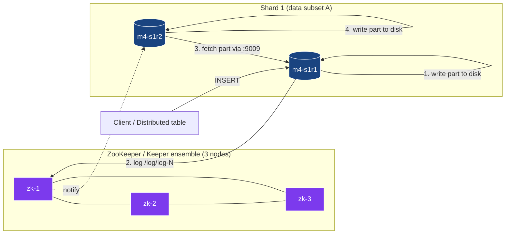
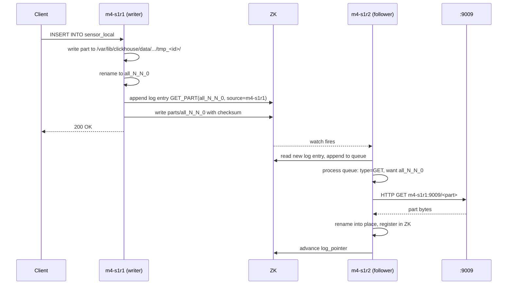

# Module 4 — Replication & High Availability

> **Audience:** anyone running CH in production. **Prerequisites:** Modules
> 1–3. **Time:** ~70 min reading + 30 min hands-on.

By the end you will be able to:

- Explain the role of ZooKeeper / Keeper in CH replication.
- Read and reason about the ZK paths under `/clickhouse/tables/...`.
- Use `system.replicas`, `system.replication_queue`, `system.zookeeper` for
  diagnosis.
- Configure `insert_quorum` and `select_sequential_consistency` for
  linearisable reads.
- Recover a wiped replica via `SYSTEM DROP REPLICA` + recreate.
- Understand the migration path from ZooKeeper to ClickHouse Keeper.

---

## 1. What "replication" means in ClickHouse

A **replicated table** uses the `Replicated*MergeTree` engine family.
Every replica of the same shard holds the **same parts** on disk. They
coordinate via **ZooKeeper** (or, more recently, **ClickHouse Keeper**, a
drop-in Raft-based replacement that ships with the server binary).

Three guarantees:

1. **All replicas converge to the same byte content** for any given table.
2. **Inserts are deduplicated** within a sliding window
   (`replicated_deduplication_window`, default 100 blocks).
3. **A replica can be entirely rebuilt from its peers** — losing a disk
   isn't catastrophic.

Three things replication does **not** do:

1. It is *not* synchronous by default. INSERT acks before peers catch up.
2. It does *not* provide cross-shard consistency. Different shards have
   different data.
3. It does *not* survive losing ZK quorum — you lose write availability
   (replicated tables go read-only) until quorum returns.

---

## 2. The replication topology



The **interserver port** (`9009` by default) is how replicas fetch parts
from each other. ZK only stores **metadata** — the part name, checksum,
which replica has the source — never the data itself.

---

## 3. The ZooKeeper schema

For a table created as

```sql
CREATE TABLE sensor_local (...)
ENGINE = ReplicatedMergeTree(
    '/clickhouse/tables/{shard}/sensor_local',
    '{replica}'
)
```

ZK ends up with this tree (showing one shard):

```
/clickhouse/tables/01/sensor_local/
├── metadata          ← schema + ENGINE
├── columns           ← column definitions
├── log/              ← the replication log
│   ├── log-0000000001
│   ├── log-0000000002
│   └── ...
├── replicas/
│   ├── m4-s1r1/
│   │   ├── log_pointer    ← last log entry this replica applied
│   │   ├── queue/         ← entries waiting to be applied
│   │   ├── parts/         ← parts this replica has
│   │   └── is_active      ← ephemeral; disappears if replica dies
│   └── m4-s1r2/
│       └── (same shape)
├── blocks/                ← INSERT dedup keys (sliding window)
├── block_numbers/         ← per-partition counters
├── leader_election/       ← which replica orchestrates merges
└── quorum/                ← insert_quorum state
```

You can browse this from SQL:

```sql
SELECT name, value FROM system.zookeeper
WHERE path = '/clickhouse/tables/01/sensor_local'
ORDER BY name;
```

### `log` is the source of truth

Every modifying operation (INSERT, MERGE, MUTATION, ATTACH, DROP_PART) is
written as a **log entry** in `/log/`. Each replica has a `log_pointer`
saying "I've applied up to entry N". The replication queue holds the
entries between `log_pointer` and the latest log entry — those are what
the replica still needs to do.

---

## 4. The replication queue lifecycle



Steady-state on a healthy cluster: `queue_size = 0`, `absolute_delay = 0`.

When a replica is down: its queue grows. When it comes back, it drains.
The drain is **eventually consistent**; for tests, force it with
`SYSTEM SYNC REPLICA <table>` — the call blocks until the queue is empty.

---

## 5. The system tables you'll live in

| Table                        | What's in it                                                                            |
|------------------------------|------------------------------------------------------------------------------------------|
| `system.replicas`            | One row per replicated table per node: queue size, log pointer, `absolute_delay`, `is_leader`, `is_readonly`. |
| `system.replication_queue`   | Per-entry detail of pending operations: type (`GET_PART`, `MERGE_PARTS`), source, retry count, last error. |
| `system.zookeeper`           | Live SQL view of ZK paths (filterable with `WHERE path = '...'`).                       |
| `system.parts`               | All parts; check `replica_name`, `replica_path`.                                         |
| `system.zookeeper_log`       | Audit trail of ZK operations this server made.                                           |
| `system.replicated_fetches`  | In-flight part fetches across the interserver port.                                      |
| `system.replicated_merge_tree_settings` | Effective settings for the engine.                                              |

The single most important field for SLOs is `system.replicas.absolute_delay`:
*seconds between the most recent INSERT's commit time and what this replica
has applied*. Alert if it goes above your tolerance (e.g. 60 s).

---

## 6. `insert_quorum` — synchronous writes when you need them

Default INSERT semantics: returns success once **one** replica has the
data. For "I need at least 2 of 2 replicas to have this row before I ack":

```sql
SET insert_quorum = 2;
SET insert_quorum_timeout_ms = 5000;     -- give up after 5s
SET insert_quorum_parallel = 1;           -- allow parallel quorum INSERTs

INSERT INTO sensor_local VALUES (...);
-- blocks until 2 replicas confirm, OR errors if quorum not met in time
```

Tradeoffs:

| `insert_quorum` | Latency  | Durability                              | Use for                            |
|----------------:|----------|-----------------------------------------|------------------------------------|
| 0 (default)     | low      | one replica before ack                  | most analytics                      |
| 1               | low      | one replica, but explicit                | same                                |
| 2               | medium   | both replicas of a 2-replica shard      | financial / regulatory             |
| `<n>`           | higher   | n replicas in shard                     | RPO=0 in multi-DC                  |

Combine with `select_sequential_consistency = 1` to get **linearisable
reads** (only consider data the quorum has seen):

```sql
SET select_sequential_consistency = 1;
SELECT count() FROM sensor_local;
```

This trades latency for "no stale reads".

---

## 7. Failure scenarios and recovery

### Scenario A — one replica down

What happens:
- Reads silently route to the other replica (zero impact).
- Writes still succeed (one-replica write); other replica's queue grows.
- ZK shows the replica's `is_active` ephemeral node disappear.

Recovery:
- `docker start m4-s1r2` (or fix the host).
- `SYSTEM SYNC REPLICA sensor_local;` on the recovered replica.
- Verify `system.replicas.absolute_delay = 0`.

### Scenario B — replica disk loss

What happens: the replica's `/var/lib/clickhouse/data` is gone. ZK still
knows it as a registered replica.

Recovery (the demo's drill 4 in M8):
1. From a peer: `SYSTEM DROP REPLICA 'm4-s1r2' FROM TABLE sensor_local;`
   This removes the dead replica's record from ZK.
2. On the wiped node: `DROP TABLE sensor_local SYNC;` (table metadata is
   gone with the disk; this clears any in-memory remnants).
3. On the wiped node: re-create the table with the same ZK path.
4. `SYSTEM SYNC REPLICA sensor_local;` — the engine pulls all parts from
   peers via the interserver port.

### Scenario C — ZK quorum lost

What happens: replicated tables go **read-only** on every node. INSERTs
fail with `Cannot allocate block number in ZooKeeper`.

Recovery: restore ZK quorum (3-of-5 or 2-of-3 ZK nodes). CH automatically
recovers when ZK is reachable again.

> **Don't let ZK be the single point of failure.** Run 3 (small clusters)
> or 5 (big clusters) ZK / Keeper nodes across availability zones.

---

## 8. ClickHouse Keeper — the future

Keeper is a **Raft-based ZK clone** that ships in the `clickhouse-server`
binary. Same client protocol, same paths. Migrate when convenient:

```bash
# Snapshot ZK
clickhouse-keeper-converter --zookeeper-logs-dir /var/lib/zookeeper/version-2/ \
                            --zookeeper-snapshots-dir /var/lib/zookeeper/version-2/ \
                            --output-dir /var/lib/clickhouse-keeper/coordination/snapshots/

# Configure CH to point at Keeper instead of ZK (just hostname/port change)
# Restart CH
```

Why move:
- One fewer service (Keeper runs in the CH process or as `clickhouse-keeper`).
- Better operational tooling (same binary, same logs format).
- Active development; ZK feature-frozen.

When **not** to move: large existing ZK fleet, complex tooling around it,
or a 3rd-party setup that already provides ZK.

This demo uses ZooKeeper (image `zookeeper:3.8`) for compatibility. The
swap-to-Keeper path is single-line in `docker-compose.yml`.

---

## 9. The hands-on demo

### Container map

| Role        | Container | Host HTTP | Host TCP |
|-------------|-----------|-----------|----------|
| Shard 1 R1  | `m4-s1r1` | 8123      | 9000     |
| Shard 1 R2  | `m4-s1r2` | 8124      | 9001     |
| Shard 2 R1  | `m4-s2r1` | 8125      | 9002     |
| Shard 2 R2  | `m4-s2r2` | 8126      | 9003     |
| Shard 3 R1  | `m4-s3r1` | 8127      | 9004     |
| Shard 3 R2  | `m4-s3r2` | 8128      | 9005     |
| ZK 1/2/3    | `m4-zk1/2/3` | (internal) | |

### Execution flow — what runs, in order

| #  | Step                                | What happens                                                                                                                                                                                                         |
|----|-------------------------------------|----------------------------------------------------------------------------------------------------------------------------------------------------------------------------------------------------------------------|
| 0  | self-bootstrap                      | If `m4-s1r1` isn't healthy, `up.sh` brings the 9-container stack up (3 ZK + 6 CH). Tears down peer demo modules first.                                                                                              |
| 1  | `setup.sql` (via `m4-s1r1`)         | `ON CLUSTER` creates `sensor_local` (ReplicatedMergeTree partitioned by day, ordered by `(sensor_id, ts)`) and a `sensor_distributed` Distributed wrapper on every node.                                            |
| 2  | `data.sql` (via `m4-s1r1`)          | Inserts 2M rows directly into `sensor_local` on `m4-s1r1` (not via Distributed). On purpose: only one replica writes; we want to watch the other catch up.                                                          |
| 3  | `SYSTEM SYNC REPLICA sensor_local`  | Run on `m4-s1r2`. Blocks until `m4-s1r2` has applied every replication-queue entry. After it returns, both replicas hold identical data.                                                                            |
| 4  | `queries.sql` (via `m4-s1r1`)       | Inspects `system.replicas`, `system.replication_queue`, `system.zookeeper` listing of `/clickhouse/tables/01/sensor_local`, and per-replica row counts via `clusterAllReplicas`.                                    |
| 5  | **Failure drill** (in run.sh)       | `docker stop m4-s1r2` → insert 500k more rows on `m4-s1r1` → `docker start m4-s1r2` → wait 5s → `SYSTEM SYNC REPLICA` on `m4-s1r2`. Confirms `m4-s1r2.count() == 2.5M` and queue drained.                            |
| 6  | `extras.sql` (via `m4-s1r1`)        | Sets `insert_quorum = 2`, `insert_quorum_timeout_ms = 5000`, inserts two rows — succeeds because both replicas are alive. Lists ZK quorum metadata. Toggles `select_sequential_consistency`. Inspects `system.replicas`. Prints a Keeper migration note. |

### What to look for

| Step                       | What you should see                                                              |
|----------------------------|----------------------------------------------------------------------------------|
| INSERT to s1r1 only        | `s1r2` row count matches after `SYSTEM SYNC REPLICA`.                            |
| `system.replicas`          | `absolute_delay = 0` once caught up; `is_leader = 1` on whichever replica leads merges. |
| Stop s1r2, insert 500k     | `s1r1.count() = 2.5M`, `s1r2.count() = 2M` (it's stopped).                       |
| Restart s1r2 + sync        | `s1r2.count() = 2.5M`; `system.replication_queue` empty.                         |
| `insert_quorum = 2` works  | Both replicas have the new rows immediately on INSERT return.                    |

---

## 10. Operational SQL cheatsheet

```sql
-- "Is replication healthy?"
SELECT database, table, replica_name, queue_size, absolute_delay,
       is_leader, is_readonly, last_queue_update_exception
FROM system.replicas
WHERE database NOT IN ('system')
ORDER BY absolute_delay DESC;

-- "What's pending for one replica?"
SELECT type, source_replica, parts_to_merge, new_part_name,
       create_time, last_attempt_time, num_tries, last_exception
FROM system.replication_queue
WHERE database = 'default' AND table = 'sensor_local'
ORDER BY create_time;

-- "Force a stuck replica to retry"
SYSTEM SYNC REPLICA sensor_local;
SYSTEM RESTART REPLICA sensor_local;        -- heavy-handed: re-init from ZK

-- "Drop a dead replica's record from ZK"
SYSTEM DROP REPLICA 'old-host-name' FROM TABLE sensor_local;

-- "What does ZK think the part list looks like?"
SELECT name FROM system.zookeeper
WHERE path = '/clickhouse/tables/01/sensor_local/replicas/m4-s1r1/parts'
ORDER BY name;
```

---

## 11. Common pitfalls

| Symptom                                                                 | Cause                                                                  | Fix                                                                                                |
|-------------------------------------------------------------------------|------------------------------------------------------------------------|----------------------------------------------------------------------------------------------------|
| `Cannot allocate block number in ZooKeeper`                             | ZK quorum lost.                                                         | Restore ZK; replicated tables auto-recover.                                                       |
| `system.replicas.is_readonly = 1` even though everything's running      | ZK session expired and didn't re-establish.                             | `SYSTEM RESTART REPLICA <table>` on the affected node.                                             |
| `absolute_delay` stuck at a high value                                  | A queue entry keeps failing to apply (corrupt part, missing source).    | `system.replication_queue.last_exception` shows why; usually `DROP PART` + re-`SYNC`.              |
| INSERT fails with `Quorum for previous write has not been satisfied`    | Previous quorum INSERT timed out; quorum lock is held in ZK.            | Wait `insert_quorum_timeout_ms`, or `SYSTEM CLEAR QUORUM` (newer CH versions).                     |
| Two replicas of one shard have different row counts but `absolute_delay = 0` | Wrote to local table on both replicas (bypassing replication).     | Don't write directly to local tables on both replicas. Always go via Distributed or one replica.   |
| `Replica … has been already created`                                    | Stale ZK record for a host that was rebuilt with the same name.         | `SYSTEM DROP REPLICA '<host>' FROM TABLE <t>;` before recreating.                                  |

---

## 12. Talking points for the live session

1. **ZK stores metadata, not data.** Every part still moves over the
   interserver port; ZK just coordinates.
2. **Replication is async by default.** Show `SYSTEM SYNC REPLICA` and
   `system.replicas.absolute_delay`.
3. **The replication queue is a real queue.** Walk through
   `system.replication_queue` mid-INSERT.
4. **`insert_quorum` is your RPO=0 knob.** Works, but raises tail latency.
5. **Replica disk loss is recoverable.** Demo the
   `SYSTEM DROP REPLICA` + recreate flow live (Module 8 does this in drill 4).
6. **ZK → Keeper.** Mention the migration. Keep ZK if you have it; new
   clusters should default to Keeper.

---

## 13. Going deeper

- **Module 5** — `ON CLUSTER` DDL coordination (also via ZK).
- **Module 8** — destructive failure drills against this same cluster.
- ClickHouse docs: <https://clickhouse.com/docs/en/engines/table-engines/mergetree-family/replication>
