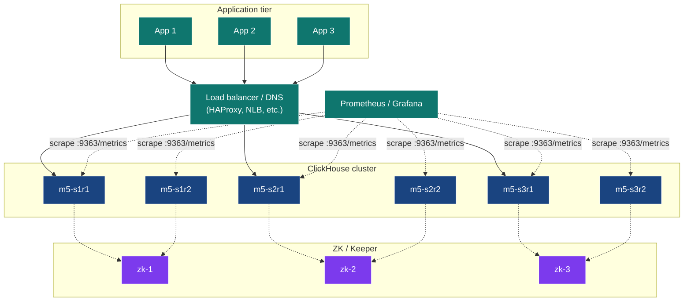
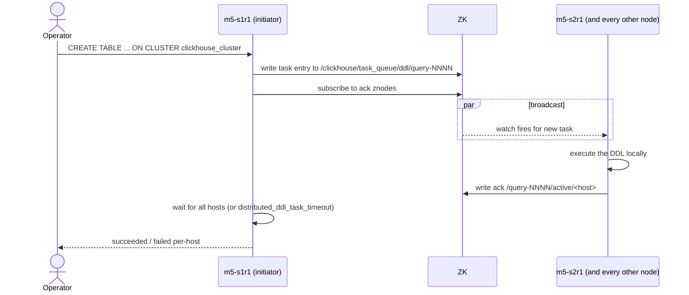
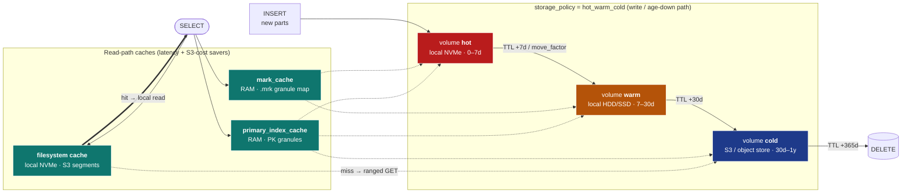

# Module 5 — Cluster Deployment & Operations

> **Audience:** anyone responsible for deploying / running CH clusters.
> **Prerequisites:** Modules 1–4. **Time:** ~70 min reading + 30 min hands-on.

By the end you will be able to:

- Drive a CH cluster as a single thing via `ON CLUSTER` DDL.
- Audit cluster operations via `system.distributed_ddl_queue`.
- Use `cluster()`, `clusterAllReplicas()`, `remote()` table functions for
  ad-hoc cross-shard queries.
- Configure users, profiles, quotas, and roles.
- Enable the built-in Prometheus exporter.
- Sketch a TLS-secured production deployment.

---

## 1. The "cluster as one thing" mental model

A ClickHouse cluster is *not* a unified service like Kafka or Postgres
streaming replication. It's **a set of independent CH processes that
share a `<remote_servers>` definition and a ZK ensemble**. There is no
"primary" or "controller". Every node knows the same cluster shape.



Coordination boundaries:

| Concern              | Coordinated via                | Stored in                            |
|----------------------|--------------------------------|--------------------------------------|
| Replication queue    | ZooKeeper / Keeper             | `/clickhouse/tables/...`             |
| ON CLUSTER DDL       | ZooKeeper / Keeper             | `/clickhouse/task_queue/ddl/...`     |
| Sharding metadata    | static XML on each node        | `<remote_servers>` in config         |
| User / role data     | static XML or SQL in `users.d` | per-node by default, or in ZK        |

---

## 2. `ON CLUSTER` — DDL fanout

```sql
CREATE TABLE analytics.page_views_local ON CLUSTER clickhouse_cluster (
    ts DateTime, user_id UInt64, page LowCardinality(String), ...
)
ENGINE = ReplicatedMergeTree(
    '/clickhouse/tables/{shard}/page_views_local',
    '{replica}'
)
ORDER BY (page, user_id, ts);
```

What happens when you run that:



The audit trail lives in `system.distributed_ddl_queue`:

```sql
SELECT entry, host_name, port, status, exception_text, query_create_time
FROM system.distributed_ddl_queue
ORDER BY query_create_time DESC LIMIT 10;
```

> **Tuning:** `distributed_ddl_task_timeout` (default 180 s) bounds the
> wait. For big clusters bump it; for CI it can be tighter.

---

## 3. The cluster-aware table functions

You don't always want a Distributed table. For one-shot queries, use:

| Function                              | Hits                            | Use for                                   |
|---------------------------------------|----------------------------------|-------------------------------------------|
| `cluster('cluster_name', db, tbl)`    | one replica per shard           | one-off fan-out aggregation                |
| `clusterAllReplicas('...', db, tbl)`  | every replica of every shard     | replica-equivalence checks (NOT aggregations) |
| `remote('host:port', db, tbl)`        | one specific host                | cross-cluster spot reads                   |
| `remoteSecure('host:port', db, tbl)`  | same, over TLS                   | production cross-cluster                   |

```sql
-- Quick "what's on each shard?" without creating a Distributed table:
SELECT shardNum() AS shard, count()
FROM cluster('clickhouse_cluster', analytics, page_views_local)
GROUP BY shard;

-- Replica-equivalence check (don't aggregate raw data over this):
SELECT hostName(), count()
FROM clusterAllReplicas('clickhouse_cluster', analytics, page_views_local)
GROUP BY hostName();

-- Pin to one specific host for diagnosis:
SELECT count() FROM remote('m5-s2r1:9000', analytics, page_views_local);
```

---

## 4. Users, profiles, quotas, roles

XML defines users; SQL defines roles and grants. Both live for the
lifetime of the server; for dynamic auth, use the SQL form.

### Anatomy of `users.xml`

```xml
<clickhouse>
    <profiles>            <!-- session-level settings -->
        <default>
            <max_threads>8</max_threads>
            <load_balancing>random</load_balancing>
            <log_queries>1</log_queries>
        </default>
        <heavy>
            <max_memory_usage>4000000000</max_memory_usage>
            <max_threads>16</max_threads>
            <max_execution_time>120</max_execution_time>
        </heavy>
        <readonly>
            <readonly>1</readonly>
        </readonly>
    </profiles>

    <quotas>              <!-- rolling limits -->
        <analyst_quota>
            <interval>
                <duration>3600</duration>
                <queries>1000</queries>
                <read_rows>1000000000</read_rows>
                <execution_time>1800</execution_time>
            </interval>
        </analyst_quota>
    </quotas>

    <users>
        <admin>
            <password_sha256_hex>...</password_sha256_hex>
            <networks><ip>::/0</ip></networks>
            <profile>heavy</profile>
            <quota>default</quota>
            <access_management>1</access_management>
        </admin>
        <analyst>
            <password_sha256_hex>...</password_sha256_hex>
            <networks><ip>::/0</ip></networks>
            <profile>readonly</profile>
            <quota>analyst_quota</quota>
            <databases><analytics/><system/></databases>
        </analyst>
        <app>
            <password_sha256_hex>...</password_sha256_hex>
            <networks><ip>::/0</ip></networks>
            <profile>default</profile>
            <quota>default</quota>
            <databases><analytics/></databases>
        </app>
    </users>
</clickhouse>
```

### SQL roles + grants

Once users exist, grants are the SQL way:

```sql
CREATE ROLE reader      ON CLUSTER clickhouse_cluster;
CREATE ROLE writer      ON CLUSTER clickhouse_cluster;

GRANT SELECT ON analytics.*                       TO reader  ON CLUSTER clickhouse_cluster;
GRANT INSERT ON analytics.page_views_distributed   TO writer  ON CLUSTER clickhouse_cluster;

GRANT reader TO analyst ON CLUSTER clickhouse_cluster;
GRANT writer TO app     ON CLUSTER clickhouse_cluster;
```

Inspect:

```sql
SELECT name, storage FROM system.users  ORDER BY name;
SELECT name, storage FROM system.roles  ORDER BY name;
SELECT user_name, role_name, granted_role_is_default
FROM system.role_grants ORDER BY user_name;
SELECT * FROM system.quotas_usage WHERE name = 'analyst_quota';
```

> **Production tip:** keep `<users>` in XML for the *bootstrap* user
> (`admin`); manage everything else via SQL `CREATE USER … GRANT …`. SQL
> users go into ZK if `<user_directories>` includes
> `<replicated><zookeeper_path>...`.

---

## 5. The Prometheus endpoint

CH ships a built-in exporter. Two lines of config:

```xml
<clickhouse>
    <prometheus>
        <endpoint>/metrics</endpoint>
        <port>9363</port>
        <metrics>true</metrics>
        <events>true</events>
        <asynchronous_metrics>true</asynchronous_metrics>
        <status_info>true</status_info>
    </prometheus>
</clickhouse>
```

What it exposes:

| Metric kind                | Examples                                                     |
|----------------------------|--------------------------------------------------------------|
| Cumulative events          | `ClickHouseProfileEvents_Query`, `ClickHouseProfileEvents_InsertedRows` |
| Current values (gauges)    | `ClickHouseMetrics_Query`, `ClickHouseMetrics_PartsActive`   |
| Async metrics              | `ClickHouseAsyncMetrics_jemalloc_resident`, `..._FilesystemMainPath_AvailableINodes` |
| Status (custom)            | `ClickHouseStatusInfo_DictionaryStatus`                      |

Smoke test:

```bash
docker exec m5-s1r1 wget -qO- http://localhost:9363/metrics | head
```

A minimal Prometheus scrape config:

```yaml
scrape_configs:
  - job_name: clickhouse
    static_configs:
      - targets:
          - m5-s1r1:9363
          - m5-s1r2:9363
          - m5-s2r1:9363
          - m5-s2r2:9363
          - m5-s3r1:9363
          - m5-s3r2:9363
```

Grafana has a community dashboard (ID 14192) tuned to these metrics.

---

## 6. TLS — securing the cluster

The demo doesn't ship certs (kept out of source control), but here's the
production sketch:

```xml
<clickhouse>
    <https_port>8443</https_port>
    <tcp_port_secure>9440</tcp_port_secure>
    <interserver_https_port>9010</interserver_https_port>

    <openSSL>
        <server>
            <certificateFile>/etc/clickhouse-server/server.crt</certificateFile>
            <privateKeyFile>/etc/clickhouse-server/server.key</privateKeyFile>
            <dhParamsFile>/etc/clickhouse-server/dhparam.pem</dhParamsFile>
            <verificationMode>none</verificationMode>      <!-- or 'strict' for mTLS -->
            <loadDefaultCAFile>true</loadDefaultCAFile>
            <cacheSessions>true</cacheSessions>
            <disableProtocols>sslv2,sslv3,tlsv1,tlsv1_1</disableProtocols>
            <preferServerCiphers>true</preferServerCiphers>
        </server>
    </openSSL>
</clickhouse>
```

Generate dev certs with `mkcert` (one-liner) or `step-ca`. Production
should use real certs from your PKI, with mTLS for inter-server traffic.

Connect with TLS:

```bash
clickhouse-client --secure --port 9440 \
    --user admin --password '...' \
    -h cluster.example.com
```

---

## 7. Hot / warm / cold storage tiers — production sizing

The demo runs every node on a single local disk (kept simple so it boots on
a laptop), so — exactly like the TLS section — this is the **production
sketch** you layer on top. A real cluster almost never keeps a year of data
on the same NVMe it ingests onto: it tiers.

### The mental model: disks → volumes → policy

ClickHouse never moves data by table or by row — it moves **parts**, and it
moves them down an ordered list of volumes. Four nested objects:

| Object           | What it is                                                            |
|------------------|----------------------------------------------------------------------|
| **disk**         | one physical/logical location: local NVMe, local HDD, or S3/GCS/Azure |
| **volume**       | an ordered group of one or more disks                                 |
| **storage policy** | an ordered list of volumes; parts flow first → last                |
| **TTL … TO**     | the rule that *moves* a part to a later volume once it ages          |



> **Why parts, not rows:** a part is the immutable unit of MergeTree storage.
> Moving it is a file copy — no rewrite, no re-sort. That's why TTL moves are
> cheap relative to, say, a Postgres partition migration.

### Wiring it up (config + DDL)

`config.d/storage.xml` defines the disks and the policy:

```xml
<clickhouse>
  <storage_configuration>
    <disks>
      <hot>  <type>local</type> <path>/mnt/nvme/clickhouse/</path> </hot>
      <warm> <type>local</type> <path>/mnt/hdd/clickhouse/</path>  </warm>
      <cold>
        <type>s3</type>
        <endpoint>https://s3.amazonaws.com/my-bucket/clickhouse/</endpoint>
        <access_key_id>...</access_key_id>
        <secret_access_key>...</secret_access_key>
        <!-- S3 transport tuning (see the "S3 transport settings" table below) -->
        <s3_max_connections>1024</s3_max_connections>
        <min_bytes_for_seek>1048576</min_bytes_for_seek>   <!-- 1 MiB: below this, read through instead of a new ranged GET -->
        <s3_max_get_rps>5000</s3_max_get_rps>              <!-- client-side rate limit; dodges S3 503 SlowDown -->
      </cold>
      <!-- local-NVMe read-through cache in FRONT of S3: first read pulls a
           segment from S3 to disk, every later read is local. THIS is what
           makes a cold tier query-able instead of merely cheap. -->
      <cold_cached>
        <type>cache</type>
        <disk>cold</disk>
        <path>/mnt/nvme/s3_cache/</path>
        <max_size>200Gi</max_size>                          <!-- NVMe you hand to caching cold data -->
        <max_file_segment_size>8Mi</max_file_segment_size>  <!-- cache granularity -->
        <cache_on_write_operations>true</cache_on_write_operations>  <!-- moved-in parts land already-warm -->
        <cache_hits_threshold>2</cache_hits_threshold>      <!-- don't cache a one-off scan -->
        <load_metadata_threads>16</load_metadata_threads>
      </cold_cached>
    </disks>

    <policies>
      <hot_warm_cold>
        <volumes>
          <hot>
            <disk>hot</disk>
            <max_data_part_size_bytes>10737418240</max_data_part_size_bytes>
          </hot>
          <warm>
            <disk>warm</disk>
          </warm>
          <cold>
            <disk>cold_cached</disk>
            <prefer_not_to_merge>true</prefer_not_to_merge>
          </cold>
        </volumes>
        <move_factor>0.2</move_factor>
      </hot_warm_cold>
    </policies>
  </storage_configuration>
</clickhouse>
```

The table opts in via `storage_policy`, and TTL drives the moves:

```sql
CREATE TABLE analytics.events_local ON CLUSTER clickhouse_cluster (
    event_time DateTime,
    user_id    UInt64,
    payload    String CODEC(ZSTD(3))      -- heavier codec pays off on cold
)
ENGINE = ReplicatedMergeTree('/clickhouse/tables/{shard}/events_local', '{replica}')
ORDER BY (user_id, event_time)
TTL event_time + INTERVAL 7   DAY TO VOLUME 'warm',
    event_time + INTERVAL 30  DAY TO VOLUME 'cold',
    event_time + INTERVAL 365 DAY DELETE
SETTINGS storage_policy = 'hot_warm_cold';
```

Watch parts move:

```sql
SELECT disk_name, count() AS parts, formatReadableSize(sum(bytes_on_disk)) AS size
FROM system.parts
WHERE table = 'events_local' AND active
GROUP BY disk_name ORDER BY disk_name;

-- force a move for a demo instead of waiting for TTL:
ALTER TABLE analytics.events_local MOVE PART 'all_1_1_0' TO VOLUME 'cold';
```

### The performance parameters that matter (and *why*)

| Parameter | Scope | Default | Why you set it for tiering |
|-----------|-------|---------|----------------------------|
| `move_factor` | policy | `0.1` | When free space on a volume drops below this fraction, CH proactively pushes the *oldest* parts down a tier **before** TTL fires. Bump to `0.2` so the hot NVMe always keeps headroom for inserts + merges; if hot fills to 100% inserts **stall**. |
| `max_data_part_size_bytes` | volume | unlimited | Caps the part size allowed on a volume. Keep big merged parts *off* the small/expensive hot tier so they land on warm/cold automatically. |
| `prefer_not_to_merge` | volume | `false` | Set **true** on the cold (S3) volume. Merges re-read + re-write whole parts; on object storage that's massive egress + request cost + latency for no query benefit. |
| `perform_ttl_move_on_insert` | MergeTree setting | `1` | Set **0** under heavy ingest so a freshly-inserted-but-already-old part isn't moved *synchronously on the insert path* (which slows inserts). Let the background mover handle it. |
| `background_move_pool_size` | server | `8` | Threads dedicated to TTL/move work. Raise on clusters that tier large volumes so moves keep up with ingest. |
| `allow_remote_fs_zero_copy_replication` | server / MergeTree | `false`* | **Critical on S3 cold tiers.** Without it, every replica uploads its *own* copy of cold parts to object storage → N× storage + N× egress. With it, replicas share one set of S3 objects and only replicate metadata. Has known edge cases — pin a CH version you've tested. |
| `min_bytes_for_seek` | s3 disk | `1Mi` | Below this, CH reads a whole granule range rather than issuing a tiny ranged GET. Tunes S3 request count vs bytes transferred. |
| codec per column | DDL | `LZ4` | Use fast `LZ4` for hot-path columns, heavier `ZSTD(3+)` for columns that spend their life on cold — you trade CPU on the rare cold read for far less storage + egress. |

> **Rule of thumb for the move schedule:** size the *hot* TTL window so the
> hot volume holds **(ingest_rate × window × replication_factor) + ~30 %
> merge headroom**, and keep `move_factor` headroom on top. The 30 % is not
> optional — a merge transiently needs room for both inputs and output.

### Caches — the layer that makes a cold tier *query-able*

Tiering is only half the story. Cheap cold storage is useless if every query
that touches it pays a network round-trip per granule. ClickHouse has two
cache layers — **in RAM** and **on local disk** — and tuning them is what
turns "cold = cheap but unusable" into "cold = cheap and fine".

**1. RAM caches (server-level settings in `config.xml`):**

| Setting | Default | What it holds & why it matters more when tiered |
|---------|---------|--------------------------------------------------|
| `mark_cache_size` | `5368709120` (5 GiB) | Caches the decompressed `.mrk` **marks** — the map from granule number → byte offset inside each compressed column file. *Every* column read consults marks first; a mark **miss on a cold part is a synchronous S3 GET** before the real read even starts. This is the single highest-leverage cache on a tiered cluster — raise it to **10–20 % of RAM**. Watch `ProfileEvents` `MarkCacheHits`/`MarkCacheMisses` and `AsynchronousMetrics` `MarkCacheBytes`/`MarkCacheFiles`. |
| `primary_index_cache_size` | `5368709120` (5 GiB, CH 24.x+) | Lazily caches **primary-key index granules** instead of forcing every active part's full PK index permanently resident. This is the modern fix for the "thousands of cold parts ⇒ unbounded PK RAM" problem described below — on older versions there is no cap and the whole PK index of every part stays in memory. Size it to your hot+warm working set of parts. |
| `uncompressed_cache_size` | `8 GiB`, but **off** (`use_uncompressed_cache=0`) | Caches *decompressed* data blocks. A win for high-QPS point lookups that re-hit the same blocks; pure waste for big scans (it just churns). Leave off globally, enable per-query/profile where the access pattern is repetitive point reads. |
| `index_mark_cache_size` / `index_uncompressed_cache_size` | small | Same idea, for **secondary (skip) indexes**. Bump only if you lean on skip indexes over cold data. |

**2. Filesystem cache for the object-store tier (the `cache` disk above):**

The `cache`-type disk is a **local-NVMe read-through cache that sits in front
of S3**. First read of a cold segment fetches it from S3 onto local disk;
every subsequent read is a local read at NVMe latency. Sizing and behaviour:

| Setting (on the `cache` disk) | Guidance |
|-------------------------------|----------|
| `max_size` | The headline number: **how much NVMe you allocate to cache cold data**. Size it to your *hot subset of cold* — the slice of historical data users actually re-query (e.g. last quarter of a 1-year cold tier), not the whole tier. It competes with the hot volume for the same NVMe, so budget them together. |
| `cache_on_write_operations` | `true` so parts are cached **as they're moved/written into cold**, so freshly-tiered data is immediately warm instead of cold-cold on its first read. |
| `max_file_segment_size` | Segment granularity (default 8 MiB). Smaller = finer eviction but more metadata; the default is usually right. |
| `cache_hits_threshold` | Require N accesses before a segment is admitted, so a single ad-hoc full-history scan can't evict the genuinely-hot working set. |
| `load_metadata_threads` | Parallelism for loading cache metadata on startup — raise for large caches so restarts aren't slow. |

Query-level knobs that pair with it: `enable_filesystem_cache` (default 1);
`read_from_filesystem_cache_if_exists_otherwise_bypass_cache=1` for one-off
backfills/exports so they **read** cache but don't **pollute** it;
`filesystem_cache_max_download_size` to bound a single query's footprint.
Observe hit ratio via `system.filesystem_cache`, `AsynchronousMetrics`
`FilesystemCacheSize`/`FilesystemCacheFiles`, and the `ProfileEvents` pair
`CachedReadBufferReadFromCacheBytes` vs `CachedReadBufferReadFromSourceBytes`.

**3. S3 transport settings (request count, throughput, cost):**

| Setting | Default | Why you touch it |
|---------|---------|------------------|
| `s3_max_connections` | `1024` | Concurrent connections per S3 disk. Raise for highly-parallel cold scans; lower to cap pressure on a shared bucket. |
| `min_bytes_for_seek` | `1Mi` | Below this gap, CH reads straight through rather than issuing a new ranged GET. Each GET is latency **and** a billed request — raising this trades bytes transferred for fewer requests. |
| `s3_max_get_rps` / `s3_max_put_rps` | `0` (unlimited) | Client-side rate limits. Set them to stay under S3's per-prefix limits and dodge `503 SlowDown`, and to put a ceiling on request-cost spikes. |
| `s3_min_upload_part_size` / `s3_max_single_part_upload_size` | `16Mi` / `32Mi` | Multipart-upload sizing for the **move-out** path (writing parts to cold). Larger parts ⇒ fewer PUTs. |
| `remote_filesystem_read_method` | `threadpool` | Keep as `threadpool` so ranged reads parallelise instead of serialising. |
| `s3_retry_attempts` / `s3_request_timeout_ms` | `10` / `30000` | Resilience against transient S3 errors; tune for your provider's tail latency. |

### RAM & CPU limits — what actually constrains a tiered cluster

Tiering shifts *where* bytes live, but the bottlenecks move with them.

**RAM**

- **Primary-key index RAM scales with part count.** The cold tier with
  `prefer_not_to_merge=true` deliberately accumulates many small parts. On
  older CH the *full* sparse PK index of every active part stays permanently
  resident → lots of cold parts ⇒ real RAM pressure (and slower SELECTs,
  since there are more parts to merge at query time). On CH 24.x+,
  `primary_index_cache_size` (see the caches section) bounds this — but you
  still want to watch `system.parts` count, the root cause.
- **`mark_cache_size` is the highest-leverage cache when tiered** (default
  5 GiB). A mark miss on a cold part is a synchronous S3 GET *before* the
  real read. Raise it to 10–20 % of RAM and watch `MarkCacheMisses` — size
  this before you size anything else. (Full detail in the caches section.)
- **OS page cache only helps the hot/warm *local* tiers.** Cold (S3) reads
  get no free page-cache reuse, so the local-NVMe **filesystem cache** (the
  `cold_cached` disk above) is how you claw back locality — but its `max_size`
  is NVMe you must budget against the hot volume on the same disk.
- **Queries that span hot + cold scan more total data**, so per-query
  `max_memory_usage` for aggregations/sorts must cover the *widest* time
  range users actually query, not just the hot window.

**CPU**

- **Decompression dominates cold reads.** A cold part is fetched, then
  decompressed on every read with no page-cache shortcut — and if you chose
  `ZSTD` to save space, that's deliberately *more* CPU per byte. Size cores
  for the number of concurrent cold-scanning queries you allow.
- **Merges and TTL moves are CPU + IO heavy.** `prefer_not_to_merge` on cold
  is as much a CPU saver as a cost saver. Moves copy + checksum parts;
  schedule wide TTL windows away from query peaks.
- **Don't starve the background pools.** Moves, merges, and fetches share
  CPU with queries. On an undersized box, aggressive tiering can make the
  hot path *slower* because the mover and merger are competing for cores.

> **The trap in one sentence:** tiering trades expensive-but-fast NVMe for
> cheap-but-distant S3 — and you pay that trade back in **RAM** (more parts =
> more resident PK indexes) and **CPU** (every cold read decompresses from
> scratch). Budget both, or the cost win turns into a latency loss.

### Gotchas

| Symptom | Cause | Fix |
|---------|-------|-----|
| Inserts stall / "Cannot reserve space" | Hot volume filled before moves caught up. | Raise `move_factor`; raise `background_move_pool_size`; shorten hot TTL window. |
| First query on old data is seconds slow | Cold part fetched from S3 with no local cache. | Add a `cache`-type disk in front of S3; pre-warm with a scheduled query. |
| Cold queries *stay* slow after a warm-up read | Filesystem cache too small, or a big ad-hoc scan evicted the working set. | Raise the cache disk `max_size`; set `cache_hits_threshold`; run pollution-prone backfills with `read_from_filesystem_cache_if_exists_otherwise_bypass_cache=1`. |
| Point queries on cold are slow but scans are fine | `mark_cache_size` too small — each query re-fetches marks from S3. | Raise `mark_cache_size` to 10–20 % of RAM; check `MarkCacheMisses`. |
| S3 `503 SlowDown` / throttling under load | Too many small ranged GETs against one bucket prefix. | Set `s3_max_get_rps`; raise `min_bytes_for_seek`; make sure the filesystem cache is actually hitting. |
| "Too many parts" on the cold tier | `prefer_not_to_merge` + long retention = thousands of small parts. | Merge *before* the move (bigger parts cross the tier boundary), or accept the RAM cost knowingly. |
| S3 bill 3× expected | No zero-copy replication — every replica uploaded its own copy. | Enable `allow_remote_fs_zero_copy_replication` (on a version you've tested). |
| TTL move never happens | `perform_ttl_move_on_insert=0` and the background merge that evaluates TTL hasn't run. | `ALTER TABLE … MOVE PARTITION …`, or check `system.part_log` / `background_move_pool_size`. |

---

## 8. The hands-on demo

### What you get

```
docker-compose.yml                 9 containers (3 ZK + 6 CH, prefix m5-)
configs/cluster-node.xml           <remote_servers> + ZK
configs/users.xml                  3 users / 3 profiles / 2 quotas
configs/prometheus.xml             /metrics on :9363
configs/macros/macros-sNrM.xml     per-node {shard}/{replica}
setup.sql · data.sql · queries.sql · extras.sql
up.sh · run.sh · down.sh
```

### Container map

Same shape as M3/M4 with the `m5-` prefix; ports `8123-8128` HTTP, `9000-9005` TCP.

### Execution flow — what runs, in order

| #  | Step                                       | What happens                                                                                                                                                                                                           |
|----|--------------------------------------------|------------------------------------------------------------------------------------------------------------------------------------------------------------------------------------------------------------------------|
| 0  | self-bootstrap                             | `up.sh` brings up the cluster (9 containers) and tears down peer demo modules. `users.xml`, `prometheus.xml`, and the cluster + macros XMLs are bind-mounted into each CH node at startup.                            |
| 1  | `setup.sql` (via `m5-s1r1`)                | `ON CLUSTER` creates database `analytics`, table `analytics.page_views_local` (ReplicatedMergeTree), and Distributed wrapper `analytics.page_views_distributed`. Every replica gets all three.                         |
| 2  | `data.sql` (via `m5-s1r1`)                 | Inserts 3M rows via the Distributed table.                                                                                                                                                                            |
| 3  | `SYSTEM FLUSH DISTRIBUTED` × 6             | Drains the Distributed spool on every node so the next reads are exact.                                                                                                                                                |
| 4  | `queries.sql` (via `m5-s1r1`)              | Six queries: `system.distributed_ddl_queue`, `cluster()` table function, `clusterAllReplicas()` per-replica row count, `remote('m5-s2r1:9000', …)` direct-to-host query, distributed `EXPLAIN`, `system.clusters`. |
| 5  | `extras.sql` (via `m5-s1r1`)               | Layers SQL-managed access on top of `users.xml`: creates roles `reader` and `writer` `ON CLUSTER`, grants `reader` to `analyst` and `writer` to `app`. Inspects `system.users`, `system.roles`, `system.role_grants`, `system.grants`, `system.quotas_usage`. Prints Prometheus + TLS notes. |
| 6  | Prometheus endpoint smoke test (in run.sh) | `docker exec m5-s1r1 wget -qO- http://localhost:9363/metrics` — first 5 lines should be Prometheus-formatted metrics. Confirms the `<prometheus>` block from `02-prometheus.xml` is active.                            |

### What to look for

| Step                          | What you should see                                                                |
|-------------------------------|------------------------------------------------------------------------------------|
| `system.distributed_ddl_queue` | One row per `ON CLUSTER` DDL × every host = 6 rows for each `CREATE`.             |
| `cluster()` aggregation       | One pass, results from every shard.                                                |
| `clusterAllReplicas()`        | Two rows per shard (one per replica).                                              |
| `system.users`                | `default`, `admin`, `analyst`, `app` — all from `users.xml`.                       |
| Role grants                   | `reader → analyst`, `writer → app`.                                                |
| Prometheus smoke test         | Lines like `# HELP ClickHouseProfileEvents_Query ...`.                             |

---

## 9. Operational SQL cheatsheet

```sql
-- "Show me the cluster"
SELECT cluster, shard_num, replica_num, host_name, host_address, port,
       errors_count, slowdowns_count
FROM system.clusters WHERE cluster = 'clickhouse_cluster'
ORDER BY shard_num, replica_num;

-- "Show me everyone who can do anything"
SELECT user_name, role_name, access_type, database, table
FROM system.grants ORDER BY user_name, database;

-- "Did the last DDL succeed everywhere?"
SELECT host_name, status, exception_text
FROM system.distributed_ddl_queue
WHERE entry = 'query-0000000023';

-- "Quota usage right now"
SELECT name, queries, errors, read_rows, execution_time
FROM system.quotas_usage WHERE name != 'default';

-- "Recent slow queries cluster-wide"
SELECT hostName() AS host, query_duration_ms, query
FROM clusterAllReplicas('clickhouse_cluster', system, query_log)
WHERE event_time > now() - INTERVAL 1 HOUR
  AND type = 'QueryFinish'
ORDER BY query_duration_ms DESC LIMIT 20;
```

---

## 10. Settings worth knowing

| Setting                              | Default | What it controls                                                          |
|--------------------------------------|---------|---------------------------------------------------------------------------|
| `distributed_ddl_task_timeout`       | 180     | Seconds the initiator waits for every node to ack an ON CLUSTER DDL.      |
| `distributed_ddl_entry_format_version` | latest | Compat shim during version upgrades.                                      |
| `distributed_product_mode`           | `'deny'` | How `IN`/`JOIN` between two Distributed tables expands. `'global'` rewrites to GLOBAL IN. |
| `prefer_localhost_replica`           | 1       | When the query runs, prefer the same-host replica over a remote one.      |
| `connect_timeout_with_failover_ms`   | 50      | Inter-node TCP connect timeout before failover.                           |
| `load_balancing`                     | random  | Replica selection strategy: random, in_order, first_or_random, round_robin, nearest_hostname. |

---

## 11. Common pitfalls

| Symptom                                                                       | Cause                                                                                  | Fix                                                                                                |
|-------------------------------------------------------------------------------|----------------------------------------------------------------------------------------|----------------------------------------------------------------------------------------------------|
| `ON CLUSTER` DDL hangs                                                        | One host unreachable; `distributed_ddl_task_timeout` exceeded.                          | `system.distributed_ddl_queue.exception_text` shows which host; fix it; rerun.                     |
| `Code: 359. Table is already exists` after recreate-with-same-zk-path         | ZK still holds the old table's metadata.                                                | `DROP TABLE … ON CLUSTER … SYNC;` (note SYNC).                                                     |
| `Code: 81. Database 'analytics' doesn't exist`                                | Created database without `ON CLUSTER`; only the initiator has it.                       | Always `CREATE DATABASE … ON CLUSTER …;`.                                                          |
| `Authentication failed: password is incorrect, or there is no user with such name` from outside | Default user is loopback-only when no password set.                       | Define users in `users.d/`. The demo's `users.xml` does this.                                      |
| Prometheus scrape returns 404                                                 | `<prometheus>` block missing or pointing to wrong port.                                  | Verify `02-prometheus.xml` mounted; `wget -qO- http://node:9363/metrics` from inside.              |
| Quota seems ignored                                                           | User didn't have `<quota>` set in `users.xml`; defaults to `default` quota (no limits). | Add `<quota>name</quota>` to the user.                                                             |

---

## 12. Talking points for the live session

1. **There's no "primary" CH node.** Pick any healthy replica as the
   initiator for ON CLUSTER DDL. They all have the same view.
2. **`system.distributed_ddl_queue` is your audit log.** Show it before
   and after a `CREATE TABLE ON CLUSTER`.
3. **`cluster()` is for one-shot fan-outs.** No need to create a
   Distributed table for every diagnostic query.
4. **Profiles + quotas are CH's RBAC v0.** Roles + grants are the
   modern way; XML profiles are the bootstrap.
5. **Prometheus is one config block away.** Same metrics format every
   monitoring tool in the world speaks.
6. **TLS in production** isn't optional. Show the `<openSSL>` block;
   generate dev certs in 60 s with `mkcert`.
7. **Hot / warm / cold is a storage *policy*, not a feature flag.** CH moves
   *parts* down an ordered list of volumes on a TTL — and the bill for cheap
   cold storage is paid back in RAM (more parts = more resident PK indexes)
   and CPU (every cold read decompresses from scratch). Size both.

---

## 13. Going deeper

- **Module 6** — query optimisation against this cluster's workload.
- **Module 7** — coordinated `BACKUP TABLE … ON CLUSTER`.
- **Module 8** — what happens when this cluster catches fire.
- ClickHouse docs: <https://clickhouse.com/docs/en/operations/access-rights>
