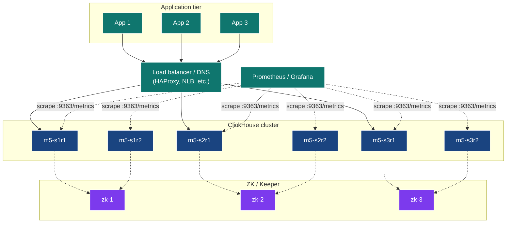
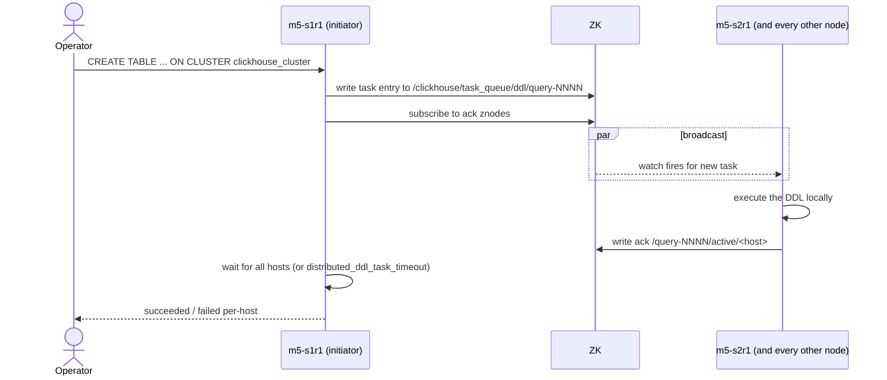

# Module 5 — Cluster Deployment & Operations

> **Audience:** anyone responsible for deploying / running CH clusters.
> **Prerequisites:** Modules 1–4. **Time:** ~70 min reading + 30 min hands-on.

By the end you will be able to:

- Drive a CH cluster as a single thing via `ON CLUSTER` DDL.
- Audit cluster operations via `system.distributed_ddl_queue`.
- Use `cluster()`, `clusterAllReplicas()`, `remote()` table functions for
  ad-hoc cross-shard queries.
- Configure users, profiles, quotas, and roles.
- Enable the built-in Prometheus exporter.
- Sketch a TLS-secured production deployment.

---

## 1. The "cluster as one thing" mental model

A ClickHouse cluster is *not* a unified service like Kafka or Postgres
streaming replication. It's **a set of independent CH processes that
share a `<remote_servers>` definition and a ZK ensemble**. There is no
"primary" or "controller". Every node knows the same cluster shape.



Coordination boundaries:

| Concern              | Coordinated via                | Stored in                            |
|----------------------|--------------------------------|--------------------------------------|
| Replication queue    | ZooKeeper / Keeper             | `/clickhouse/tables/...`             |
| ON CLUSTER DDL       | ZooKeeper / Keeper             | `/clickhouse/task_queue/ddl/...`     |
| Sharding metadata    | static XML on each node        | `<remote_servers>` in config         |
| User / role data     | static XML or SQL in `users.d` | per-node by default, or in ZK        |

---

## 2. `ON CLUSTER` — DDL fanout

```sql
CREATE TABLE analytics.page_views_local ON CLUSTER clickhouse_cluster (
    ts DateTime, user_id UInt64, page LowCardinality(String), ...
)
ENGINE = ReplicatedMergeTree(
    '/clickhouse/tables/{shard}/page_views_local',
    '{replica}'
)
ORDER BY (page, user_id, ts);
```

What happens when you run that:



The audit trail lives in `system.distributed_ddl_queue`:

```sql
SELECT entry, host_name, port, status, exception_text, query_create_time
FROM system.distributed_ddl_queue
ORDER BY query_create_time DESC LIMIT 10;
```

> **Tuning:** `distributed_ddl_task_timeout` (default 180 s) bounds the
> wait. For big clusters bump it; for CI it can be tighter.

---

## 3. The cluster-aware table functions

You don't always want a Distributed table. For one-shot queries, use:

| Function                              | Hits                            | Use for                                   |
|---------------------------------------|----------------------------------|-------------------------------------------|
| `cluster('cluster_name', db, tbl)`    | one replica per shard           | one-off fan-out aggregation                |
| `clusterAllReplicas('...', db, tbl)`  | every replica of every shard     | replica-equivalence checks (NOT aggregations) |
| `remote('host:port', db, tbl)`        | one specific host                | cross-cluster spot reads                   |
| `remoteSecure('host:port', db, tbl)`  | same, over TLS                   | production cross-cluster                   |

```sql
-- Quick "what's on each shard?" without creating a Distributed table:
SELECT shardNum() AS shard, count()
FROM cluster('clickhouse_cluster', analytics, page_views_local)
GROUP BY shard;

-- Replica-equivalence check (don't aggregate raw data over this):
SELECT hostName(), count()
FROM clusterAllReplicas('clickhouse_cluster', analytics, page_views_local)
GROUP BY hostName();

-- Pin to one specific host for diagnosis:
SELECT count() FROM remote('m5-s2r1:9000', analytics, page_views_local);
```

---

## 4. Users, profiles, quotas, roles

XML defines users; SQL defines roles and grants. Both live for the
lifetime of the server; for dynamic auth, use the SQL form.

### Anatomy of `users.xml`

```xml
<clickhouse>
    <profiles>            <!-- session-level settings -->
        <default>
            <max_threads>8</max_threads>
            <load_balancing>random</load_balancing>
            <log_queries>1</log_queries>
        </default>
        <heavy>
            <max_memory_usage>4000000000</max_memory_usage>
            <max_threads>16</max_threads>
            <max_execution_time>120</max_execution_time>
        </heavy>
        <readonly>
            <readonly>1</readonly>
        </readonly>
    </profiles>

    <quotas>              <!-- rolling limits -->
        <analyst_quota>
            <interval>
                <duration>3600</duration>
                <queries>1000</queries>
                <read_rows>1000000000</read_rows>
                <execution_time>1800</execution_time>
            </interval>
        </analyst_quota>
    </quotas>

    <users>
        <admin>
            <password_sha256_hex>...</password_sha256_hex>
            <networks><ip>::/0</ip></networks>
            <profile>heavy</profile>
            <quota>default</quota>
            <access_management>1</access_management>
        </admin>
        <analyst>
            <password_sha256_hex>...</password_sha256_hex>
            <networks><ip>::/0</ip></networks>
            <profile>readonly</profile>
            <quota>analyst_quota</quota>
            <databases><analytics/><system/></databases>
        </analyst>
        <app>
            <password_sha256_hex>...</password_sha256_hex>
            <networks><ip>::/0</ip></networks>
            <profile>default</profile>
            <quota>default</quota>
            <databases><analytics/></databases>
        </app>
    </users>
</clickhouse>
```

### SQL roles + grants

Once users exist, grants are the SQL way:

```sql
CREATE ROLE reader      ON CLUSTER clickhouse_cluster;
CREATE ROLE writer      ON CLUSTER clickhouse_cluster;

GRANT SELECT ON analytics.*                       TO reader  ON CLUSTER clickhouse_cluster;
GRANT INSERT ON analytics.page_views_distributed   TO writer  ON CLUSTER clickhouse_cluster;

GRANT reader TO analyst ON CLUSTER clickhouse_cluster;
GRANT writer TO app     ON CLUSTER clickhouse_cluster;
```

Inspect:

```sql
SELECT name, storage FROM system.users  ORDER BY name;
SELECT name, storage FROM system.roles  ORDER BY name;
SELECT user_name, role_name, granted_role_is_default
FROM system.role_grants ORDER BY user_name;
SELECT * FROM system.quotas_usage WHERE name = 'analyst_quota';
```

> **Production tip:** keep `<users>` in XML for the *bootstrap* user
> (`admin`); manage everything else via SQL `CREATE USER … GRANT …`. SQL
> users go into ZK if `<user_directories>` includes
> `<replicated><zookeeper_path>...`.

---

## 5. The Prometheus endpoint

CH ships a built-in exporter. Two lines of config:

```xml
<clickhouse>
    <prometheus>
        <endpoint>/metrics</endpoint>
        <port>9363</port>
        <metrics>true</metrics>
        <events>true</events>
        <asynchronous_metrics>true</asynchronous_metrics>
        <status_info>true</status_info>
    </prometheus>
</clickhouse>
```

What it exposes:

| Metric kind                | Examples                                                     |
|----------------------------|--------------------------------------------------------------|
| Cumulative events          | `ClickHouseProfileEvents_Query`, `ClickHouseProfileEvents_InsertedRows` |
| Current values (gauges)    | `ClickHouseMetrics_Query`, `ClickHouseMetrics_PartsActive`   |
| Async metrics              | `ClickHouseAsyncMetrics_jemalloc_resident`, `..._FilesystemMainPath_AvailableINodes` |
| Status (custom)            | `ClickHouseStatusInfo_DictionaryStatus`                      |

Smoke test:

```bash
docker exec m5-s1r1 wget -qO- http://localhost:9363/metrics | head
```

A minimal Prometheus scrape config:

```yaml
scrape_configs:
  - job_name: clickhouse
    static_configs:
      - targets:
          - m5-s1r1:9363
          - m5-s1r2:9363
          - m5-s2r1:9363
          - m5-s2r2:9363
          - m5-s3r1:9363
          - m5-s3r2:9363
```

Grafana has a community dashboard (ID 14192) tuned to these metrics.

---

## 6. TLS — securing the cluster

The demo doesn't ship certs (kept out of source control), but here's the
production sketch:

```xml
<clickhouse>
    <https_port>8443</https_port>
    <tcp_port_secure>9440</tcp_port_secure>
    <interserver_https_port>9010</interserver_https_port>

    <openSSL>
        <server>
            <certificateFile>/etc/clickhouse-server/server.crt</certificateFile>
            <privateKeyFile>/etc/clickhouse-server/server.key</privateKeyFile>
            <dhParamsFile>/etc/clickhouse-server/dhparam.pem</dhParamsFile>
            <verificationMode>none</verificationMode>      <!-- or 'strict' for mTLS -->
            <loadDefaultCAFile>true</loadDefaultCAFile>
            <cacheSessions>true</cacheSessions>
            <disableProtocols>sslv2,sslv3,tlsv1,tlsv1_1</disableProtocols>
            <preferServerCiphers>true</preferServerCiphers>
        </server>
    </openSSL>
</clickhouse>
```

Generate dev certs with `mkcert` (one-liner) or `step-ca`. Production
should use real certs from your PKI, with mTLS for inter-server traffic.

Connect with TLS:

```bash
clickhouse-client --secure --port 9440 \
    --user admin --password '...' \
    -h cluster.example.com
```

---

## 7. The hands-on demo

### What you get

```
docker-compose.yml                 9 containers (3 ZK + 6 CH, prefix m5-)
configs/cluster-node.xml           <remote_servers> + ZK
configs/users.xml                  3 users / 3 profiles / 2 quotas
configs/prometheus.xml             /metrics on :9363
configs/macros/macros-sNrM.xml     per-node {shard}/{replica}
setup.sql · data.sql · queries.sql · extras.sql
up.sh · run.sh · down.sh
```

### Container map

Same shape as M3/M4 with the `m5-` prefix; ports `8123-8128` HTTP, `9000-9005` TCP.

### Execution flow — what runs, in order

| #  | Step                                       | What happens                                                                                                                                                                                                           |
|----|--------------------------------------------|------------------------------------------------------------------------------------------------------------------------------------------------------------------------------------------------------------------------|
| 0  | self-bootstrap                             | `up.sh` brings up the cluster (9 containers) and tears down peer demo modules. `users.xml`, `prometheus.xml`, and the cluster + macros XMLs are bind-mounted into each CH node at startup.                            |
| 1  | `setup.sql` (via `m5-s1r1`)                | `ON CLUSTER` creates database `analytics`, table `analytics.page_views_local` (ReplicatedMergeTree), and Distributed wrapper `analytics.page_views_distributed`. Every replica gets all three.                         |
| 2  | `data.sql` (via `m5-s1r1`)                 | Inserts 3M rows via the Distributed table.                                                                                                                                                                            |
| 3  | `SYSTEM FLUSH DISTRIBUTED` × 6             | Drains the Distributed spool on every node so the next reads are exact.                                                                                                                                                |
| 4  | `queries.sql` (via `m5-s1r1`)              | Six queries: `system.distributed_ddl_queue`, `cluster()` table function, `clusterAllReplicas()` per-replica row count, `remote('m5-s2r1:9000', …)` direct-to-host query, distributed `EXPLAIN`, `system.clusters`. |
| 5  | `extras.sql` (via `m5-s1r1`)               | Layers SQL-managed access on top of `users.xml`: creates roles `reader` and `writer` `ON CLUSTER`, grants `reader` to `analyst` and `writer` to `app`. Inspects `system.users`, `system.roles`, `system.role_grants`, `system.grants`, `system.quotas_usage`. Prints Prometheus + TLS notes. |
| 6  | Prometheus endpoint smoke test (in run.sh) | `docker exec m5-s1r1 wget -qO- http://localhost:9363/metrics` — first 5 lines should be Prometheus-formatted metrics. Confirms the `<prometheus>` block from `02-prometheus.xml` is active.                            |

### What to look for

| Step                          | What you should see                                                                |
|-------------------------------|------------------------------------------------------------------------------------|
| `system.distributed_ddl_queue` | One row per `ON CLUSTER` DDL × every host = 6 rows for each `CREATE`.             |
| `cluster()` aggregation       | One pass, results from every shard.                                                |
| `clusterAllReplicas()`        | Two rows per shard (one per replica).                                              |
| `system.users`                | `default`, `admin`, `analyst`, `app` — all from `users.xml`.                       |
| Role grants                   | `reader → analyst`, `writer → app`.                                                |
| Prometheus smoke test         | Lines like `# HELP ClickHouseProfileEvents_Query ...`.                             |

---

## 8. Operational SQL cheatsheet

```sql
-- "Show me the cluster"
SELECT cluster, shard_num, replica_num, host_name, host_address, port,
       errors_count, slowdowns_count
FROM system.clusters WHERE cluster = 'clickhouse_cluster'
ORDER BY shard_num, replica_num;

-- "Show me everyone who can do anything"
SELECT user_name, role_name, access_type, database, table
FROM system.grants ORDER BY user_name, database;

-- "Did the last DDL succeed everywhere?"
SELECT host_name, status, exception_text
FROM system.distributed_ddl_queue
WHERE entry = 'query-0000000023';

-- "Quota usage right now"
SELECT name, queries, errors, read_rows, execution_time
FROM system.quotas_usage WHERE name != 'default';

-- "Recent slow queries cluster-wide"
SELECT hostName() AS host, query_duration_ms, query
FROM clusterAllReplicas('clickhouse_cluster', system, query_log)
WHERE event_time > now() - INTERVAL 1 HOUR
  AND type = 'QueryFinish'
ORDER BY query_duration_ms DESC LIMIT 20;
```

---

## 9. Settings worth knowing

| Setting                              | Default | What it controls                                                          |
|--------------------------------------|---------|---------------------------------------------------------------------------|
| `distributed_ddl_task_timeout`       | 180     | Seconds the initiator waits for every node to ack an ON CLUSTER DDL.      |
| `distributed_ddl_entry_format_version` | latest | Compat shim during version upgrades.                                      |
| `distributed_product_mode`           | `'deny'` | How `IN`/`JOIN` between two Distributed tables expands. `'global'` rewrites to GLOBAL IN. |
| `prefer_localhost_replica`           | 1       | When the query runs, prefer the same-host replica over a remote one.      |
| `connect_timeout_with_failover_ms`   | 50      | Inter-node TCP connect timeout before failover.                           |
| `load_balancing`                     | random  | Replica selection strategy: random, in_order, first_or_random, round_robin, nearest_hostname. |

---

## 10. Common pitfalls

| Symptom                                                                       | Cause                                                                                  | Fix                                                                                                |
|-------------------------------------------------------------------------------|----------------------------------------------------------------------------------------|----------------------------------------------------------------------------------------------------|
| `ON CLUSTER` DDL hangs                                                        | One host unreachable; `distributed_ddl_task_timeout` exceeded.                          | `system.distributed_ddl_queue.exception_text` shows which host; fix it; rerun.                     |
| `Code: 359. Table is already exists` after recreate-with-same-zk-path         | ZK still holds the old table's metadata.                                                | `DROP TABLE … ON CLUSTER … SYNC;` (note SYNC).                                                     |
| `Code: 81. Database 'analytics' doesn't exist`                                | Created database without `ON CLUSTER`; only the initiator has it.                       | Always `CREATE DATABASE … ON CLUSTER …;`.                                                          |
| `Authentication failed: password is incorrect, or there is no user with such name` from outside | Default user is loopback-only when no password set.                       | Define users in `users.d/`. The demo's `users.xml` does this.                                      |
| Prometheus scrape returns 404                                                 | `<prometheus>` block missing or pointing to wrong port.                                  | Verify `02-prometheus.xml` mounted; `wget -qO- http://node:9363/metrics` from inside.              |
| Quota seems ignored                                                           | User didn't have `<quota>` set in `users.xml`; defaults to `default` quota (no limits). | Add `<quota>name</quota>` to the user.                                                             |

---

## 11. Talking points for the live session

1. **There's no "primary" CH node.** Pick any healthy replica as the
   initiator for ON CLUSTER DDL. They all have the same view.
2. **`system.distributed_ddl_queue` is your audit log.** Show it before
   and after a `CREATE TABLE ON CLUSTER`.
3. **`cluster()` is for one-shot fan-outs.** No need to create a
   Distributed table for every diagnostic query.
4. **Profiles + quotas are CH's RBAC v0.** Roles + grants are the
   modern way; XML profiles are the bootstrap.
5. **Prometheus is one config block away.** Same metrics format every
   monitoring tool in the world speaks.
6. **TLS in production** isn't optional. Show the `<openSSL>` block;
   generate dev certs in 60 s with `mkcert`.

---

## 12. Going deeper

- **Module 6** — query optimisation against this cluster's workload.
- **Module 7** — coordinated `BACKUP TABLE … ON CLUSTER`.
- **Module 8** — what happens when this cluster catches fire.
- ClickHouse docs: <https://clickhouse.com/docs/en/operations/access-rights>
