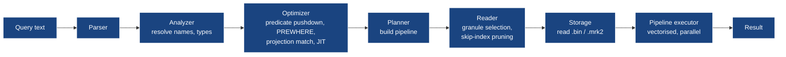
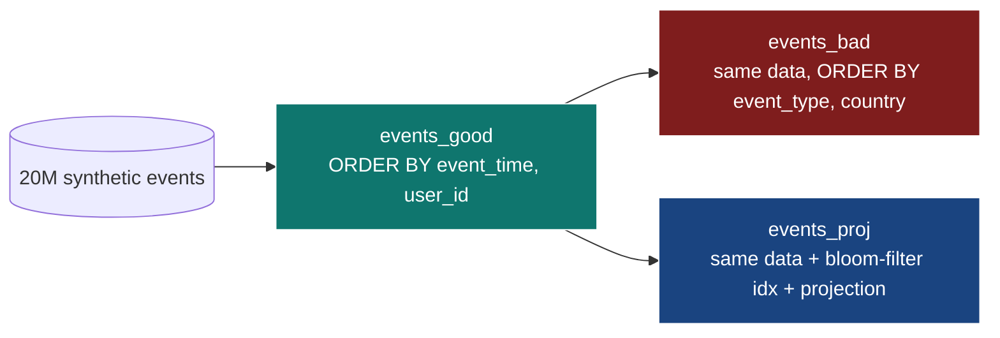

# Module 6 — Query Optimisation & Performance

> **Audience:** anyone making CH queries fast — or wondering why theirs
> aren't. **Prerequisites:** Modules 1–2. **Time:** ~75 min reading + 30
> min hands-on with measurable timings on 60M rows.

By the end you will be able to:

- Read a CH query plan (`EXPLAIN`, `EXPLAIN SYNTAX`, `EXPLAIN PIPELINE`,
  `EXPLAIN PROJECTION`, `EXPLAIN indexes = 1`).
- Diagnose performance from `system.query_log` and `system.parts`.
- Choose `ORDER BY`, `PRIMARY KEY`, projections, and skip-indexes for the
  workload.
- Use `PREWHERE` and `SAMPLE` correctly.
- Pick between `ANY`, `ALL`, `ASOF`, and dictionary JOINs.
- Build a Materialized View that pre-aggregates at write time.

---

## 1. The query lifecycle



What you actually tune at each step:

| Stage          | Knobs you control                                                                  |
|----------------|------------------------------------------------------------------------------------|
| Reader         | `ORDER BY`, `PARTITION BY`, projections, skip-indexes, `PREWHERE`, `SAMPLE`         |
| Optimizer      | settings (`optimize_read_in_order`, `optimize_use_projections`, JIT, `compile_aggregate_expressions`) |
| Pipeline       | `max_threads`, `max_memory_usage`, parallel replicas                                |
| Result         | `max_block_size`, format choice                                                     |

---

## 2. The first thing to check: did the engine read what you think it did?

```sql
SELECT
    query_duration_ms,
    read_rows,
    formatReadableSize(read_bytes) AS read_bytes,
    formatReadableSize(memory_usage) AS mem,
    result_rows
FROM system.query_log
WHERE event_time > now() - INTERVAL 5 MINUTE
  AND type = 'QueryFinish'
ORDER BY event_time DESC LIMIT 10;
```

**`read_rows` is the truth.** If your `WHERE` filter looks selective but
`read_rows ≈ total table size`, the index didn't help.

`SYSTEM FLUSH LOGS;` first if the table is empty — `query_log` is
flushed periodically (~7.5 s default), not synchronously.

---

## 3. ORDER BY shape — where almost every win comes from

The same 20M rows, three table layouts (this is what the demo tests):

| Layout                                    | Filter `WHERE event_time BETWEEN 'a' AND 'b'`    | Filter `WHERE country = 'US'` |
|-------------------------------------------|--------------------------------------------------|-------------------------------|
| `ORDER BY (event_type, country)`          | full scan (no time prefix in PK)                 | partial via secondary scan    |
| `ORDER BY (event_time, user_id)`          | granule pruning → reads ~1/30th                  | full scan, scans by date      |
| `ORDER BY (event_time, user_id)` + projection on `(country, day)` | granule pruning            | reads from projection (tiny)  |

### How to choose

1. **What's the most common WHERE filter?** That column should be the
   *first* in `ORDER BY`. Time-series workloads almost always lead with
   `event_time` or its truncation (`toStartOfHour(event_time)`).
2. **What's the most common GROUP BY?** Putting that column second
   enables `optimize_aggregation_in_order`.
3. **High-cardinality columns later in the key.** `user_id` after
   `event_time` is fine; `event_time` after `user_id` would scatter
   adjacent rows in time across the file.

---

## 4. Projections — second copies optimised for a different shape

Projections are *managed-by-the-engine* materialised aggregations / sort
orders that live alongside the main part.

```sql
CREATE TABLE events_proj (
    event_time DateTime,
    user_id    UInt64,
    country    LowCardinality(String),
    amount     Float64,

    PROJECTION pv_country_day (
        SELECT country, toDate(event_time) AS day,
               count(), sum(amount), avg(amount)
        GROUP BY country, day
    )
)
ENGINE = MergeTree
ORDER BY (event_time, user_id);
```

What happens:
- Every part now also stores a projection part (a tiny aggregated
  sub-table).
- A query of the right shape reads from the projection, not the base
  table.
- Triggered automatically when `optimize_use_projections = 1` (default)
  *and* the query matches.

```sql
EXPLAIN PROJECTION = 1
SELECT country, toDate(event_time) AS day, count()
FROM events_proj
WHERE event_time BETWEEN '2026-02-01' AND '2026-02-28'
GROUP BY country, day;
-- Plan should mention "Projection: pv_country_day"
```

| Win                                                          | Cost                              |
|--------------------------------------------------------------|-----------------------------------|
| Aggregation queries 10–100× faster                           | Projection storage ≈ size of the aggregate result × number of parts |
| No application changes                                       | Mutations rewrite the projection too |
| Multiple projections per table                               | Slower writes (each projection is computed) |

---

## 5. Skip indexes — granule pruning for the second column

Skip indexes prune **granules**, not rows. A skip index on column X is
useful when X *isn't* in the PK prefix but you filter on it.

| Type                    | Stores                              | Best for                                  |
|-------------------------|-------------------------------------|-------------------------------------------|
| `minmax`                | min, max per N granules             | Range filters on numeric/date columns     |
| `set(K)`                | up to K distinct values per N granules | `IN` / `=` on low-cardinality columns  |
| `bloom_filter`          | bloom filter per N granules         | High-cardinality `=` filters (like `user_id`) |
| `tokenbf_v1(L, K, S)`   | per-token bloom filter              | Substring search via `hasToken()`         |
| `ngrambf_v1(N, L, K, S)`| per-ngram bloom filter              | LIKE searches with `%abc%`                |

```sql
CREATE TABLE events_idx (
    event_time DateTime,
    user_id    UInt64,
    country    LowCardinality(String),
    amount     Float64,
    url        String,

    INDEX idx_amount  amount  TYPE minmax        GRANULARITY 4,
    INDEX idx_country country TYPE set(100)      GRANULARITY 4,
    INDEX idx_user    user_id TYPE bloom_filter() GRANULARITY 4,
    INDEX idx_url_tok url     TYPE tokenbf_v1(8192, 3, 0) GRANULARITY 4
)
ENGINE = MergeTree ORDER BY (event_time, user_id);
```

`GRANULARITY = 4` means "one index entry per 4 marks" — i.e. one entry per
~32k rows. Higher granularity = smaller index, less precise; lower = larger.

**A skip index never produces wrong results.** It just *might* fail to
prune (false positives in bloom filters → still read the granule). If
your queries don't filter on the indexed column, the index is dead weight
on writes — drop it.

---

## 6. PREWHERE — read less

CH automatically rewrites cheap predicates into `PREWHERE`, which reads
the predicate columns first, prunes granules, and only then reads the
remaining columns.

```sql
-- These are equivalent on CH 21+:
SELECT count() FROM events WHERE country = 'US' AND amount > 100;
SELECT count() FROM events PREWHERE country = 'US' WHERE amount > 100;
```

You'd write `PREWHERE` explicitly when:

- The optimiser picks the wrong predicate to push down (rare on modern CH).
- You want to *guarantee* the order: cheap filter first, expensive later.

`EXPLAIN SYNTAX` shows what the optimiser actually did:

```sql
EXPLAIN SYNTAX
SELECT count() FROM events WHERE country = 'US' AND amount > 100;
```

---

## 7. SAMPLE — orders-of-magnitude faster, with caveats

`SAMPLE` reads a *consistent fraction* of rows. Requires `SAMPLE BY` in
the table definition.

```sql
CREATE TABLE events_sampled (
    ...
)
ENGINE = MergeTree
ORDER BY (event_time, intHash32(user_id), user_id)
SAMPLE BY intHash32(user_id);

SELECT count() * 10, avg(amount) FROM events_sampled SAMPLE 0.1;
-- ≈ 10× faster, ~10× variance
```

| Use SAMPLE for                     | Don't use SAMPLE for                                       |
|------------------------------------|------------------------------------------------------------|
| Real-time dashboards over fresh data | Exact-count metrics                                       |
| `quantile`, `avg`, `count` approximations | Reports auditors will scrutinise                      |
| Iterative exploration              | Joins (sampling on both sides is hard to reason about)     |

---

## 8. JOIN strategies

CH joins are *generally* slower than its scans. Pick wisely.

| Join type         | Right-side cardinality | Left-side cardinality | Behaviour                                          |
|-------------------|------------------------|----------------------|----------------------------------------------------|
| `INNER JOIN`      | small                  | any                   | Hash-build right, stream left.                     |
| `LEFT/RIGHT JOIN` | small                  | any                   | Same; null-fill non-matches.                       |
| `ANY LEFT JOIN`   | any                    | any                   | First match per left row. Faster than ALL.         |
| `ALL LEFT JOIN`   | any                    | any                   | Cartesian on duplicates (default behaviour).       |
| `ASOF LEFT JOIN`  | any                    | any                   | Match nearest-but-not-after on a continuous column. |
| Dictionary lookup | tiny (< 100M rows)     | huge                  | Best-of-class for small dim tables.                |

### Dictionary as a JOIN replacement

```sql
CREATE DICTIONARY users_dict (
    user_id UInt64,
    cohort  String,
    signup_date Date
)
PRIMARY KEY user_id
SOURCE(CLICKHOUSE(host 'localhost' port 9000 db 'm6' table 'users_dim'))
LIFETIME(MIN 60 MAX 300)
LAYOUT(HASHED());

SYSTEM RELOAD DICTIONARY m6.users_dict;

-- Now lookups are RAM-resident hashmap reads:
SELECT count(),
       avgIf(amount, dictGetString('m6.users_dict', 'cohort', user_id) = 'alpha')
FROM events_good;
```

| Layout            | RAM            | Lookup speed | Use for                      |
|-------------------|----------------|--------------|------------------------------|
| `HASHED`          | high           | fastest      | < 50M small rows             |
| `SPARSE_HASHED`   | medium         | fast         | < 200M rows                  |
| `RANGE_HASHED`    | medium         | fast         | versioned dim with date ranges |
| `IP_TRIE`         | low            | fast         | IPv4/IPv6 ranges             |
| `CACHE`           | configurable   | medium       | huge dims, slower miss path  |
| `DIRECT`          | none           | slow         | always queries the source    |

---

## 9. Materialized Views for query optimisation

A MV pre-computes aggregates **at INSERT time**. Read latency is then a
function of the MV's row count, not the source's.

```sql
CREATE TABLE country_daily (
    day Date, country LowCardinality(String),
    events UInt64, revenue Float64
) ENGINE = SummingMergeTree ORDER BY (day, country);

CREATE MATERIALIZED VIEW country_daily_mv TO country_daily AS
SELECT toDate(event_time) AS day, country,
       count() AS events, sum(amount) AS revenue
FROM events_good
GROUP BY day, country;

-- Backfill once
INSERT INTO country_daily
SELECT toDate(event_time), country, count(), sum(amount)
FROM events_good GROUP BY toDate(event_time), country;
```

Reads from `country_daily` are millions of times smaller than from
`events_good`. Module 2 covers MV semantics in depth.

---

## 10. The `EXPLAIN` family

| Form                            | Shows                                                                  |
|---------------------------------|------------------------------------------------------------------------|
| `EXPLAIN`                       | Plan tree (the default).                                               |
| `EXPLAIN AST`                   | Raw parser AST.                                                        |
| `EXPLAIN SYNTAX`                | Query *as the optimiser rewrote it* (PREWHERE pushdown, alias inlining). |
| `EXPLAIN PIPELINE`              | The actual pipeline (operators, threads, branches).                    |
| `EXPLAIN PIPELINE graph = 1`    | DOT format; pipe to graphviz for a picture.                            |
| `EXPLAIN PLAN actions = 1`      | Per-operator action list — every projection/filter/aggregate.          |
| `EXPLAIN indexes = 1`           | Which indexes (PK, partition, skip) the planner used.                  |
| `EXPLAIN PROJECTION = 1`        | Whether a projection got picked.                                       |
| `EXPLAIN ESTIMATE`              | Estimated rows/parts/granules to read.                                 |

```sql
EXPLAIN indexes = 1
SELECT count() FROM events_proj WHERE user_id = 12345;
-- Looks for: "Skip index: idx_user (bloom_filter)"
```

---

## 11. The hands-on demo

### What you get

```
docker-compose.yml          m6-clickhouse · 6 GB memory
configs/clickhouse-config.xml
setup.sql · data.sql · queries.sql · extras.sql
up.sh · run.sh · down.sh
```

### Three layouts of the same 20M rows



### Execution flow — what runs, in order

| #  | Step          | What happens                                                                                                                                                                                                            |
|----|---------------|-------------------------------------------------------------------------------------------------------------------------------------------------------------------------------------------------------------------------|
| 0  | self-bootstrap | If `m6-clickhouse` isn't healthy, `up.sh` brings it up. The container is given a 6 GB memory limit because the dataset is large.                                                                                       |
| 1  | `setup.sql`   | Creates database `m6` and three identically-shaped tables: `events_bad` (wrong PK), `events_good` (right PK), `events_proj` (right PK + bloom-filter on user_id + projection on (country, day)).                       |
| 2  | `data.sql`    | Inserts 20M rows into `events_good`, then `INSERT INTO bad/proj SELECT * FROM events_good` so all three tables hold identical data. `OPTIMIZE FINAL` on each so timings aren't muddied by background merges. ~30–60s. |
| 3  | `queries.sql` | Five comparisons: time-range count on each layout (Q1), country aggregation on each (Q2 — projection should crush), point lookup by user_id (Q3 — skip index helps), `EXPLAIN indexes=1` and `EXPLAIN PROJECTION=1` (Q4), then `SYSTEM FLUSH LOGS` + `system.query_log` summary (Q5). |
| 4  | `extras.sql`  | More tools: PREWHERE (auto + explicit, with `EXPLAIN SYNTAX`), `SAMPLE BY intHash32(user_id)` table copy and `SAMPLE 0.1` query, three more skip-index types (`minmax`, `set`, `tokenbf_v1`), JOIN strategies (`ANY` vs `ALL` vs Dictionary lookup) against a 500k-row `users_dim`, and a Materialized View (`country_daily_mv` → `country_daily` SummingMergeTree) with a backfill. |

### What you should observe

The exact numbers depend on hardware; the *ratios* are stable. On an
M-series MacBook the demo typically prints:

| Query                               | BAD ordering            | GOOD ordering            | PROJ + skip idx                    |
|-------------------------------------|-------------------------|--------------------------|-------------------------------------|
| Q1 — time range                     | scans most parts        | reads few granules        | reads few granules                |
| Q2 — country aggregation per month  | ~1.8 s, ~20M read       | ~0.25 s, ~5M read         | ~0.02 s, ~3k read                  |
| Q3 — point lookup by user_id        | scans all rows          | scans all rows            | bloom filter prunes most marks     |

---

## 12. Settings worth knowing for query work

| Setting                                | Default | Effect                                                              |
|----------------------------------------|--------|---------------------------------------------------------------------|
| `max_threads`                          | cores  | Per-query parallelism.                                              |
| `max_memory_usage`                     | 10 GB  | Per-query memory cap. Aggregations OOM here.                        |
| `max_bytes_before_external_group_by`   | 0      | If > 0, spill GROUP BY to disk above this size.                     |
| `optimize_read_in_order`               | 1      | Skip sort if PK already orders the data.                            |
| `optimize_aggregation_in_order`        | 0      | Stream aggregation when PK matches GROUP BY prefix.                 |
| `optimize_use_projections`             | 1      | Try to match a projection.                                          |
| `compile_aggregate_expressions`        | 1      | JIT-compile aggregate functions.                                    |
| `parallel_replicas_for_non_replicated_merge_tree` | 0   | Allow parallel replicas mode even on non-replicated tables.        |
| `max_block_size`                       | 65536  | Rows per pipeline block. Bigger = more memory, fewer overhead bumps. |

---

## 13. Common pitfalls

| Symptom                                                                | Cause                                                                                | Fix                                                                                              |
|------------------------------------------------------------------------|--------------------------------------------------------------------------------------|--------------------------------------------------------------------------------------------------|
| `WHERE date_col = '2026-05-01'` reads everything                       | `date_col` not in PK prefix; or filter on `toDate(date_col)` while PK is `DateTime`. | Match the type/expression exactly. Use a function-index or partition key.                        |
| Projection isn't picked                                                | Query shape doesn't match projection.                                                | `EXPLAIN PROJECTION = 1` to see *why*. Reshape the query or add another projection.              |
| Bloom-filter index doesn't help                                        | Granularity too coarse; or column has high collision rate.                           | Lower `GRANULARITY`; verify with `EXPLAIN indexes = 1`.                                          |
| `Memory limit (for query) exceeded`                                    | Aggregation cardinality > `max_memory_usage`.                                        | Set `max_bytes_before_external_group_by` to spill to disk.                                       |
| Same query is fast once, slow on second run                            | Filesystem page cache cold the first time, hot the second.                           | Benchmark with `SYSTEM DROP MARK CACHE` and `SYSTEM DROP UNCOMPRESSED CACHE` between runs.       |
| `JOIN` is slow                                                         | Right-hand side too big.                                                             | Use a Dictionary; pre-aggregate; or use `IN (SELECT ...)` with `SETTINGS distributed_product_mode='global'`. |
| `SAMPLE` returns wildly different counts on re-runs                    | Forgot `SAMPLE BY` in the table definition; SAMPLE became a no-op or random.         | `SHOW CREATE TABLE` and add `SAMPLE BY ...`.                                                     |

---

## 14. Talking points for the live session

1. **`read_rows` is your X-ray machine.** Show before/after on the same
   query.
2. **`ORDER BY` is the highest-leverage knob.** Run Q1 on the `BAD` and
   `GOOD` tables side-by-side and watch the ratio.
3. **Projections are not free.** They add write-time cost but query-time
   wins are 10–100×.
4. **Skip indexes prune granules, not rows.** Show `idx_user` on a point
   lookup; `EXPLAIN indexes = 1` shows the prune.
5. **PREWHERE is auto.** `EXPLAIN SYNTAX` reveals it. Don't write it
   unless the optimiser picks wrong.
6. **Dictionary > JOIN** for small dim tables. Demo with the 500k-row
   `users_dim`.
7. **Materialized Views finish the job.** Once a query is materialised,
   it's microseconds regardless of source size.

---

## 15. Going deeper

- **Module 2** — Materialized Views in detail.
- **Module 3** — distributed query plans.
- **CH docs**: <https://clickhouse.com/docs/en/optimize/query-optimization>
- **Profile-guided optimisation:** load `system.query_log` into a
  separate table, then aggregate by query pattern to find your top
  offenders.
