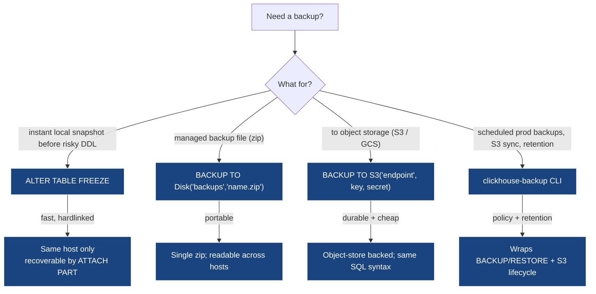

# Module 7 — Backup & Recovery

> **Audience:** anyone whose job depends on the data not vanishing.
> **Prerequisites:** Modules 1–4. **Time:** ~60 min reading + 30 min hands-on.

By the end you will be able to:

- Choose between FREEZE, BACKUP, and `clickhouse-backup` for a workload.
- Set up a backups disk (local) and an S3-backed backup (MinIO here).
- Build incremental backup chains.
- Run async backups and poll their status.
- Restore from a chain into a clean database.
- Plan a backup schedule and restore drill cadence.

---

## 1. The backup options at a glance



| Mechanism                           | Time       | Portable | Cluster-aware | Best for                                        |
|-------------------------------------|------------|----------|---------------|-------------------------------------------------|
| `ALTER TABLE … FREEZE`              | instant    | no       | no            | "I'm about to do something risky, snap it now."  |
| `BACKUP … TO Disk('backups', ...)`  | seconds    | yes      | with `ON CLUSTER` | scheduled local backups; nightly cron.       |
| `BACKUP … TO S3(...)`               | seconds-minutes | yes | with `ON CLUSTER` | production durable backups.                  |
| `clickhouse-backup` (Altinity CLI)  | depends    | yes      | yes           | full ops layer: retention, S3 lifecycle, scheduling. |

---

## 2. FREEZE — hardlinked instant snapshots

```sql
ALTER TABLE m7.transactions FREEZE WITH NAME 'demo_snap';
```

What it actually does:

```
/var/lib/clickhouse/data/m7/transactions/
├── 202601_1_1_0/
│   ├── columns.txt
│   ├── ... (data)
└── ...

/var/lib/clickhouse/shadow/demo_snap/
└── data/m7/transactions/
    ├── 202601_1_1_0/   ← hardlinks to the same inodes
    └── ...
```

- **Hardlinks**, not copies. Constant time, zero extra disk while the
  source parts still exist.
- Once a part is merged away, the hardlink in `shadow/` is the *only*
  remaining reference — at which point the inode survives until you
  delete the shadow dir.
- Recovery: copy the hardlinks somewhere safe, then re-import via
  `ALTER TABLE … ATTACH PART`.

> **FREEZE is local-only.** It doesn't help against host loss. Use it
> for "I'm about to do something I might regret" — not as your DR plan.

---

## 3. The `BACKUP` / `RESTORE` SQL

This is the modern, portable way. Targets a registered "backup
destination": a local disk, an S3 bucket, or an HTTP endpoint.

### Configure a destination

The destination must be in the server config:

```xml
<storage_configuration>
    <disks>
        <backups>
            <type>local</type>
            <path>/var/lib/clickhouse/backups/</path>
        </backups>
    </disks>
</storage_configuration>

<backups>
    <allowed_disk>backups</allowed_disk>
    <allowed_path>/var/lib/clickhouse/backups/</allowed_path>
</backups>
```

Without `<backups><allowed_disk>` ClickHouse refuses any BACKUP /
RESTORE command. This is a safety net.

### Full backup → restore

```sql
BACKUP TABLE m7.transactions TO Disk('backups', 'transactions_disk_v1.zip');

-- Verify what got written
SELECT id, name, status, total_size, num_files
FROM system.backups WHERE name LIKE '%transactions_disk_v1%';

-- Drop and restore
DROP TABLE m7.transactions;
RESTORE TABLE m7.transactions FROM Disk('backups', 'transactions_disk_v1.zip');
SELECT count() FROM m7.transactions;
```

### Async backup

For tables larger than your HTTP timeout:

```sql
BACKUP TABLE m7.transactions
TO Disk('backups', 'transactions_async.zip')
SETTINGS async = 1;

-- Poll
SELECT status FROM system.backups
WHERE name LIKE '%transactions_async%' ORDER BY start_time DESC LIMIT 1;
-- Wait until it's BACKUP_CREATED.
```

### Incremental backup

Reference the previous full as `base_backup`. Only changed parts are
written.

```sql
-- Full
BACKUP TABLE t TO Disk('backups', 't_full.zip');

-- New rows...
INSERT INTO t SELECT ...;

-- Incremental
BACKUP TABLE t
TO Disk('backups', 't_inc_v2.zip')
SETTINGS base_backup = Disk('backups', 't_full.zip');

-- Restore: just point at the most recent incremental;
-- CH walks the chain back to the base automatically.
RESTORE TABLE t FROM Disk('backups', 't_inc_v2.zip');
```

The same setting works against S3 — see
[`queries-incremental-s3.sql`](queries-incremental-s3.sql) for the runnable
version. `base_backup` takes a **full destination spec**, not a name:

```sql
BACKUP TABLE m7.transactions
TO S3('http://m7-minio:9000/clickhouse-backups/txn_inc_v2', 'minioadmin', 'minioadmin')
SETTINGS base_backup = S3('http://m7-minio:9000/clickhouse-backups/txn_inc_base', 'minioadmin', 'minioadmin');
```

#### Reading the result

`system.backups` distinguishes what a backup *contains* from what it
*stored*. This is the pair to show people:

```sql
SELECT name, base_backup_name, num_files, num_entries,
       formatReadableSize(total_size)      AS logical_size,
       formatReadableSize(compressed_size) AS actually_written
FROM system.backups ORDER BY start_time;
```

| backup | base | num_files | num_entries | logical | written |
|---|---|---|---|---|---|
| `txn_inc_base` | — | 62 | 55 | 27.69 MiB | 27.70 MiB |
| `txn_inc_v2` | `txn_inc_base` | 74 | **9** | 30.52 MiB | **2.84 MiB** |

74 files visible, 9 written. In the bucket that's 56 objects / 28 MiB for
the base against 10 objects / 2.8 MiB for the incremental, and the
incremental's `data/m7/transactions/` holds exactly one part directory
(`202602_4_4_0`).

Dedup is at **part** granularity. Append-only partitioned tables
incremental beautifully. A table that rewrites parts — heavy merges, a
mutation, a re-inserted partition — can produce an "incremental" nearly the
size of a full, because a rewritten part is a *new* part.

#### The chain is a hard dependency

Restoring points at the newest incremental and ClickHouse walks backwards.
Delete the base, though, and every incremental behind it is scrap:

```
Code: 599. DB::Exception: Backup S3('.../txn_inc_base', ...) not found.
           (BACKUP_NOT_FOUND)
```

No partial recovery, and no warning when you delete it — the bucket is
happy to let you. Retention must expire a base together with its
dependants, or take a fresh full before expiring the old one. This is the
usual way teams find out their backups were worthless, and the best
argument for section 5's tooling over a hand-rolled cron job.

### Backup specific partitions

```sql
BACKUP TABLE t
PARTITIONS '202601', '202602'
TO Disk('backups', 't_jan_feb.zip');
```

Useful for "back up just the changed month".

### `BACKUP ON CLUSTER`

For a Replicated table on a cluster, `BACKUP ON CLUSTER` coordinates
across replicas so the snapshot is consistent:

```sql
BACKUP TABLE analytics.page_views_local
ON CLUSTER clickhouse_cluster
TO Disk('backups', 'page_views.zip');
```

Each replica writes to its local `Disk('backups', ...)` — so for cluster
backups you typically point at S3 instead, where every replica writes to
the same bucket.

---

## 4. S3 backups (the production path)

```sql
BACKUP TABLE m7.transactions
TO S3(
    'http://m7-minio:9000/clickhouse-backups/transactions_s3_v1',
    'minioadmin',
    'minioadmin'
);
```

Argument layout: `S3('<endpoint>/<bucket>/<key-prefix>', '<access_key>',
'<secret_key>')`. The endpoint can be AWS S3, MinIO, GCS S3-compat, R2, etc.

What MinIO actually receives:

```
clickhouse-backups/
└── transactions_s3_v1/
    ├── .backup           ← manifest (JSON-ish)
    ├── data/
    │   └── m7/transactions/
    │       └── <part_name>/
    │           ├── columns.txt
    │           ├── checksums.txt
    │           └── ... .bin / .mrk2
    └── metadata/
        └── m7/
            └── transactions.sql
```

The format is *part-level*. That means:
- Incremental backups across S3 share parts (no double-copy).
- A reasonably-equipped human can extract data by hand if needed.

### Restoring from S3

```sql
RESTORE TABLE m7.transactions
FROM S3(
    'http://m7-minio:9000/clickhouse-backups/transactions_s3_v1',
    'minioadmin',
    'minioadmin'
);
```

---

## 5. `clickhouse-backup` — the operations layer

Runnable in this demo: **[`backup-tool.sh`](backup-tool.sh)**, configured by
**[`configs/clickhouse-backup.yml`](configs/clickhouse-backup.yml)**.

### How it actually works

It does *not* issue `BACKUP TO S3` on the server's behalf. It runs
`ALTER TABLE ... FREEZE`, reads the resulting hardlinks out of
`/var/lib/clickhouse/shadow/`, and uploads them itself. Two consequences:

- It must have the ClickHouse **data directory on a local mount** — hence
  `m7-backup-tool` sharing the `m7_data` volume in `docker-compose.yml`.
- It connects over the **native protocol** (9000), not HTTP.

### Commands

```bash
# Two-phase: snapshot now (cheap, instant), ship later
clickhouse-backup create        nightly-2026-07-26
clickhouse-backup upload        nightly-2026-07-26

# Or both at once
clickhouse-backup create_remote nightly-2026-07-26

# Incremental — diff against a REMOTE backup by name
clickhouse-backup create_remote --diff-from-remote=nightly-2026-07-26 \
                                inc-2026-07-27
#   --diff-from  is the local-only equivalent

# Recovery
clickhouse-backup restore_remote inc-2026-07-27
clickhouse-backup restore_remote --schema inc-2026-07-27     # schema only
clickhouse-backup restore_remote --restore-table-mapping='transactions:transactions_verify' \
                                 inc-2026-07-27              # restore beside the live table

# Maintenance
clickhouse-backup list local
clickhouse-backup list remote
clickhouse-backup delete remote nightly-2026-04-01
clickhouse-backup print-config          # merged config incl. env overrides
clickhouse-backup default-config        # every key with its default
```

### What incremental looks like

`list remote` shows the dependency in a `required` column:

```
full-20260726-114022   remote                          all:30.58MiB, ...
inc-20260726-114022    remote  +full-20260726-114022   all:2.16MiB,  ...
```

Measured on the demo table: **full upload 30.58 MiB → incremental upload
2.16 MiB**. But restoring the incremental with nothing cached locally
downloads **32.67 MiB**:

```
downloadDiffParts  table=m7.transactions  diff_parts=4  diff_bytes=30.52MiB
download           download_size=32.67MiB
```

Backup cost scales with what changed; **restore cost scales with the whole
dataset**. Size your RTO against the second number.

### Config keys that matter

Full annotated file in `configs/clickhouse-backup.yml`. The ones people get
wrong:

| Key | Why it matters |
|---|---|
| `general.upload_by_part: true` | What makes `--diff-from-remote` cheap. Off = every backup is silently a full. Default true — don't "tidy" it away. |
| `general.backups_to_keep_local` / `_remote` | Retention. Default **0 = keep forever**, which is how disks and S3 bills fill up. |
| `s3.force_path_style: true` | **Required for MinIO** (bucket in path, not in hostname). Leave `false` for real AWS S3. |
| `s3.disable_ssl: true` | Only because the demo MinIO is plain HTTP. Never in production. |
| `s3.compression_format: tar` | `tar` = package, don't compress. `.bin` files are already codec-compressed; gzip/zstd burns CPU for near-zero gain. |
| `clickhouse.log_sql_queries` | Defaults to `true` and logs every internal query at INF. Set `false` or output is unreadable. |
| `general.upload_max_bytes_per_second` | Throttle so backups don't starve query I/O. `0` = unlimited. |
| `clickhouse.host` + `port: 9000` | Native protocol. Pointing at 8123 fails confusingly. |

Every key is overridable by env var (`SECTION_KEY` uppercased —
`S3_ACCESS_KEY`, `CLICKHOUSE_PASSWORD`). That is how you keep credentials
out of the YAML in production.

### Gotcha: `DROP TABLE ... SYNC` before a tool restore

A plain `DROP TABLE` on an Atomic database parks the data directory for
`database_atomic_delay_before_drop_table_sec` (**default 480s**) so
`UNDROP TABLE` can work. `clickhouse-backup` recreates the table with its
**original UUID**, so it collides with the parked directory:

```
Code: 57. Directory for table data store/ae2/ae215ea4-.../ already exists
```

Native `RESTORE` never hits this — it assigns a fresh UUID. Only the tool
preserves them. Use `DROP TABLE ... SYNC`, or
`--restore-table-mapping` to a different name. Cleaning up after the
collision means deleting `metadata_dropped/` entries and `store/` dirs by
hand.

### What it adds over raw SQL

- Retention rules, applied automatically on every create/upload.
- Named backups instead of hand-managed S3 key prefixes.
- Dependency tracking, so it knows an incremental needs its base.
- Schema-only restore, table remapping, resumable uploads, I/O throttling.
- `watch` mode: a built-in scheduler (`full_interval`, `watch_interval`).
- RBAC (users/roles/grants) backed up alongside data — `rbac_backup_always`
  defaults to true. Restoring data without RBAC is a classic half-recovery.

Repo: <https://github.com/Altinity/clickhouse-backup>.

---

## 6. Partition operations — the cheap surrogate

For tables you partition by date:

```sql
-- Snapshot a partition (still hardlinks under shadow/)
ALTER TABLE t FREEZE PARTITION '202601';

-- Detach a partition (moves to detached/, queries don't see it)
ALTER TABLE t DETACH PARTITION '202601';

-- Re-attach when ready
ALTER TABLE t ATTACH PARTITION '202601';

-- Drop irrevocably (use with caution; ATTACH FROM detached still possible briefly)
ALTER TABLE t DROP PARTITION '202601';

-- Move a partition between two same-schema tables
ALTER TABLE t_archive ATTACH PARTITION '202601' FROM t;
```

`ATTACH PARTITION FROM` is the single most useful trick for "promote a
staging table into the live table" — fully atomic, no rewrites.

---

## 7. The hands-on demo

### What you get

```
docker-compose.yml                 m7-clickhouse + m7-minio + m7-minio-init + m7-backup-tool
configs/clickhouse-config.xml      includes <backups> + <storage_configuration>
configs/default-user.xml           opens the default-user ACL to the docker network
configs/clickhouse-backup.yml      annotated clickhouse-backup config
setup.sql · queries.sql · queries-s3.sql · queries-incremental-s3.sql · extras.sql
backup-tool.sh                     clickhouse-backup full + incremental + DR restore
up.sh · run.sh · down.sh
```

### Container map

| Service     | Container         | Host ports         |
|-------------|-------------------|--------------------|
| ClickHouse  | `m7-clickhouse`   | 8123, 9000         |
| MinIO       | `m7-minio`        | 9100 (S3), 9101 (console) |
| Bootstrap   | `m7-minio-init`   | (one-shot)         |
| Backup tool | `m7-backup-tool`  | (idle; `docker exec` into it) |

MinIO console: <http://localhost:9101>, login `minioadmin` / `minioadmin`.
From your host the S3 API is `localhost:9100`; from inside `m7-net` it is
`m7-minio:9000`. Same MinIO, opposite sides of the port mapping — that is
why the SQL says `9000` and your browser says `9101`.

`m7-backup-tool` shares the `m7_data` volume with ClickHouse because
`clickhouse-backup` reads the data directory directly. It idles on
`sleep infinity`; drive it with `docker exec m7-backup-tool clickhouse-backup …`
or just run `./backup-tool.sh`.

The `default` user's ACL is widened in `configs/default-user.xml` — the
stock image restricts it to `127.0.0.1`, which the backup tool (a separate
container) cannot satisfy. Same fix modules 3 and 4 needed for distributed
queries.

### Execution flow — what runs, in order

| #  | Step                                            | What happens                                                                                                                                                                              |
|----|-------------------------------------------------|------------------------------------------------------------------------------------------------------------------------------------------------------------------------------------------|
| 0  | self-bootstrap                                  | `up.sh` brings up CH + MinIO + the bucket bootstrap (`m7-minio-init` creates `clickhouse-backups`). Both share `m7-net`, so CH can reach `http://m7-minio:9000`.                          |
| 1  | `setup.sql`                                     | Creates database `m7`, table `m7.transactions` (MergeTree partitioned by month, ordered by `(account_id, txn_time, txn_id)`), inserts 2M synthetic rows.                                  |
| 2  | `queries.sql` — local-disk backup path          | `ALTER TABLE … FREEZE WITH NAME 'demo_snap'` (instant hardlinks under `/var/lib/clickhouse/shadow/`), `BACKUP TABLE … TO Disk('backups', 'transactions_disk_v1.zip')`, `DROP TABLE`, `RESTORE TABLE … FROM Disk(…)`, then per-partition `DETACH PARTITION '202601'` + `ATTACH PARTITION '202601'`. |
| 3  | `queries-s3.sql` — S3 backup path               | `BACKUP TABLE … TO S3('http://m7-minio:9000/clickhouse-backups/transactions_s3_v1', 'minioadmin', 'minioadmin')`, look up the backup row in `system.backups`, `DROP TABLE`, `RESTORE … FROM S3(…)`. Verify row count returns to 2M. |
| 4  | `extras.sql` — async + incremental              | `BACKUP TABLE … SETTINGS async = 1` (returns immediately), poll loop on `system.backups.status` until `BACKUP_CREATED`. Insert 50k more rows, then `BACKUP … SETTINGS base_backup = Disk('backups', 'transactions_disk_v1.zip')` — the resulting incremental zip is much smaller. `DROP TABLE`, `RESTORE FROM Disk('backups', 'transactions_inc_v2.zip')` — CH walks the chain to the base. Prints notes on `BACKUP ON CLUSTER`. |
| 5  | `queries-incremental-s3.sql` — incremental to S3 | Full base to MinIO, insert a new February partition, then `BACKUP … SETTINGS base_backup = S3(…)`. Compares `num_files` vs `num_entries` in `system.backups` (74 visible / 9 written), restores from the incremental alone, and documents the `BACKUP_NOT_FOUND` failure you get when the base is deleted. |
| 6  | `backup-tool.sh` — the ops layer (run separately) | `clickhouse-backup create_remote`, insert a March partition, `create_remote --diff-from-remote`, `list remote` (shows the `+base` dependency), then a genuine DR drill: delete local backups, `DROP TABLE … SYNC`, `restore_remote` from the incremental. Not part of `run.sh` — invoke it yourself. |

### What you should observe

| Step                              | Outcome                                                                                  |
|-----------------------------------|------------------------------------------------------------------------------------------|
| `FREEZE`                          | `/var/lib/clickhouse/shadow/demo_snap/` exists with hardlinks; same inodes as live data. |
| `BACKUP TO Disk`                  | Zip file under `/var/lib/clickhouse/backups/`; `system.backups.status = 'BACKUP_CREATED'`. |
| `DROP` + `RESTORE`                | Row count returns to 2,000,000.                                                           |
| Partition detach/attach           | Row count drops then returns; no data rewrite.                                            |
| `BACKUP TO S3`                    | Visible in MinIO console at <http://localhost:9101>; nested under `clickhouse-backups/transactions_s3_v1/`. |
| Async backup                      | Returns immediately; status flips through `CREATING_BACKUP` → `BACKUP_CREATED`.           |
| Incremental                       | `total_size` of `transactions_inc_v2.zip` ≪ `transactions_disk_v1.zip`.                  |

---

## 8. A reasonable production schedule

| Cadence  | What                                          | Where                              |
|----------|-----------------------------------------------|------------------------------------|
| Daily    | Full `BACKUP ON CLUSTER` to S3                | `s3://backups/clickhouse/<env>/<date>/full` |
| Hourly   | Incremental against the day's full            | `s3://.../<date>/inc-NN`            |
| Weekly   | Restore drill into a sandbox cluster          | scratch S3 path; verify counts      |
| 30 days  | Lifecycle to Glacier / Coldline               | bucket lifecycle rule               |

> **A backup you have never restored is not a backup.** Run a restore
> drill at least monthly. Module 8's drill 6 exercises this end-to-end.

---

## 9. Operational SQL cheatsheet

```sql
-- "What backups exist?"
SELECT id, name, status, formatReadableSize(total_size) AS size,
       num_files, start_time, end_time
FROM system.backups ORDER BY start_time DESC LIMIT 20;

-- "What's running right now?"
SELECT id, name, status, num_files, processed_files
FROM system.backups WHERE status IN ('CREATING_BACKUP','RESTORING') ;

-- "Which freezes are still on disk?"
-- (no system table; check the shadow/ dir)
-- docker exec m7-clickhouse ls /var/lib/clickhouse/shadow/

-- "Drop a stuck async backup"
SYSTEM SHUTDOWN BACKUP <backup_id>;       -- newer CH; varies by version
```

---

## 10. Settings worth knowing

| Setting                              | Effect                                                                |
|--------------------------------------|-----------------------------------------------------------------------|
| `async = 1` on BACKUP                | Returns immediately; poll `system.backups`.                           |
| `base_backup = Disk('...', 'name')`  | Make this an incremental against the named base.                      |
| `compression_method = 'zstd'`        | Compress the backup file (default depends on destination).            |
| `password = '...'`                   | Encrypt the backup (file destination only).                           |
| `s3_max_connections`                 | Concurrency for S3 backup/restore I/O.                                |
| `allow_drop_detached`                | Allow `DROP DETACHED PART` (safety knob; off by default).             |

---

## 11. Common pitfalls

| Symptom                                                                      | Cause                                                                       | Fix                                                                                              |
|------------------------------------------------------------------------------|-----------------------------------------------------------------------------|--------------------------------------------------------------------------------------------------|
| `Code: 605. The maximum size of file system disk is allowed for backups...`  | Backup destination not in `<allowed_disk>` / `<allowed_path>`.              | Add it to `<backups>` in config.                                                                 |
| `BACKUP TO Disk(...)` works but takes forever                                | Tons of small parts (single-row INSERTs from upstream).                     | Optimise / batch upstream. Backup time scales with part count.                                   |
| `RESTORE` fails with "Backup data not found"                                 | Pointed at the wrong base or chain broken.                                  | Verify `system.backups` knows the chain; restore from the highest layer.                         |
| FREEZE makes disk usage spike when old parts merge                           | Hardlinks still reference old part files; merges can't reclaim.             | Clear `shadow/` directories you no longer need.                                                  |
| S3 backup with self-signed MinIO fails on TLS                                | The S3 endpoint URL uses `https://` and the cert isn't trusted.             | Use `http://` for MinIO, or mount the CA into CH and trust it.                                   |
| `BACKUP ON CLUSTER` fails on one node                                        | That node can't reach the destination.                                      | Verify per-node connectivity (e.g. all hosts can resolve the S3 endpoint).                       |

---

## 12. Talking points for the live session

1. **Three layers, three uses.** FREEZE for "oh wait, hold on";
   BACKUP/RESTORE for routine; `clickhouse-backup` for ops scale.
2. **Backups are part-level.** Show MinIO contents; the directory tree
   matches the live data layout.
3. **Incrementals are nearly free** if your data is mostly append.
4. **Restore drills are the test.** Without monthly drills you don't
   have backups, you have hopes.
5. **Partition operations** (DETACH / ATTACH) are the secret weapon for
   archive workflows.
6. **`ON CLUSTER`** for replicated tables — coordinated snapshot.

---

## 13. Going deeper

- **Module 8** — DR drills, including end-to-end backup-restore over
  a cluster.
- ClickHouse docs: <https://clickhouse.com/docs/en/operations/backup>
- `clickhouse-backup`: <https://github.com/Altinity/clickhouse-backup>
