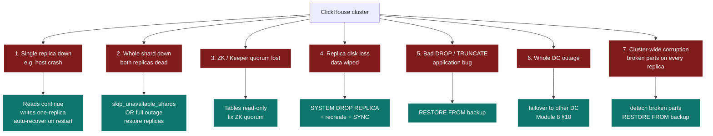
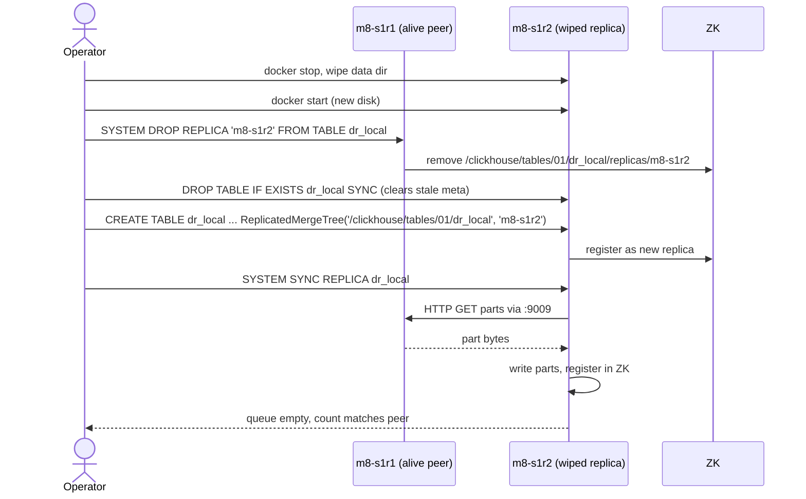
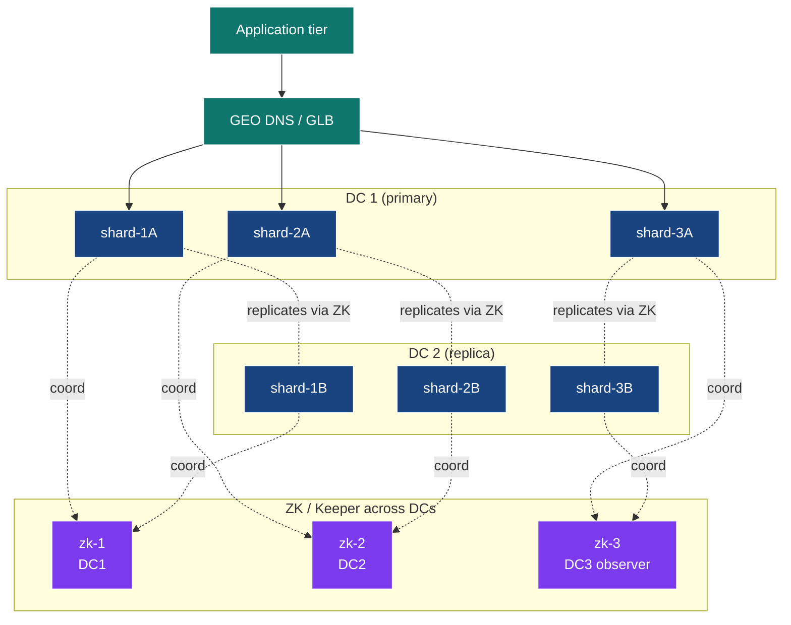

# Module 8 — Disaster Recovery & Business Continuity

> **Audience:** people with pagers. **Prerequisites:** Modules 1, 3, 4, 7.
> **Time:** ~75 min reading + 30 min hands-on chaos drills.

By the end you will be able to:

- Define and measure RTO / RPO for each failure class.
- Run six destructive drills against a real cluster without flinching.
- Recover a wiped replica from a peer.
- Use `insert_quorum` to harden writes against partial-replica failure.
- Sketch a multi-DC topology and cut-over procedure.

---

## 1. Failure modes you should be ready for



| #  | Class                       | Likelihood | Blast radius            | Recovery primitive                   |
|----|-----------------------------|------------|-------------------------|--------------------------------------|
| 1  | Single replica down         | high       | none (peer covers)      | restart + `SYSTEM SYNC REPLICA`      |
| 2  | Whole shard down            | medium     | partial reads           | `skip_unavailable_shards = 1`        |
| 3  | ZK / Keeper quorum lost     | medium     | writes blocked          | restore ZK quorum                    |
| 4  | Replica disk loss           | medium     | one replica empty       | `SYSTEM DROP REPLICA` + recreate     |
| 5  | Bad DROP / TRUNCATE         | high       | catastrophic if no backup | RESTORE from backup                  |
| 6  | Whole DC outage             | low        | total in that DC        | failover to peer DC                  |
| 7  | Cluster-wide corruption     | very low   | catastrophic            | RESTORE from backup                  |

---

## 2. RTO and RPO

| Term | Definition                                                          | How CH lets you tune it                                              |
|------|---------------------------------------------------------------------|----------------------------------------------------------------------|
| RTO  | **Recovery Time Objective** — how long until service resumes.       | Replicas (instant), backup restore time (minutes-hours), DR cluster (seconds with prior sync). |
| RPO  | **Recovery Point Objective** — how much data you can afford to lose. | `insert_quorum` (zero loss in shard), backup cadence (minutes-hours), cross-DC replication (zero with quorum). |

A two-replica shard with `insert_quorum = 2` has **RPO=0 within the
shard** and **RTO≈0** for single-replica failure. Add nightly S3 backups
and you have **RPO≤24h** for the bad-DROP case with **RTO≤restore time**.

---

## 3. Drill 1 — single replica down

The most common, least scary failure.

```bash
docker stop m8-s1r2
```

Then on `m8-s1r1`:

```sql
-- Cluster sees one bad replica
SELECT host_name, errors_count FROM system.clusters
WHERE cluster='clickhouse_cluster' ORDER BY shard_num, replica_num;

-- Reads still work via the surviving replica
SELECT count() FROM dr_distributed;

-- Inserts also work (routed to s1r1, replicated later)
INSERT INTO dr_local VALUES (now(), 999999999, 'during_outage_1');
```

Recovery:

```bash
docker start m8-s1r2
```

```sql
SYSTEM SYNC REPLICA dr_local;        -- on m8-s1r2
SELECT count() FROM dr_local WHERE key >= 999999998;
```

`absolute_delay` should drop to 0. The replication queue drains.

---

## 4. Drill 2 — whole shard outage

```bash
docker stop m8-s2r1 m8-s2r2
```

Reads:

```sql
-- Partial — returns rows from shards 1 and 3 only
SELECT count() FROM dr_distributed SETTINGS skip_unavailable_shards = 1;

-- Without it: errors out
SELECT count() FROM dr_distributed;
-- Code: 279. NETWORK_ERROR ... All connection tries failed
```

`skip_unavailable_shards` is a *per-query* policy decision. Use it for
dashboards that prefer "stale + visible" over "blank". Don't use it for
financial reports.

Recovery: bring the shard back, run `SYSTEM SYNC REPLICA` on each replica.

---

## 5. Drill 3 — ZK quorum partial loss

A 3-node ZK ensemble survives 1 failure. Lose 1, the cluster keeps
working. Lose 2 of 3 and replicated tables go read-only.

Drill the safe case:

```bash
docker stop m8-zk1
```

```sql
-- Inserts still work — ZK quorum is 2 of 3
INSERT INTO dr_local VALUES (now(), 1, 'zk1_down');
SELECT count() FROM dr_local WHERE payload = 'zk1_down';
```

```bash
docker start m8-zk1
```

> **Production:** run 3 ZK / Keeper nodes for small clusters, 5 for big
> ones. Spread them across availability zones.

---

## 6. Drill 4 — replica disk loss (the hard one)

What happens: one replica's `/var/lib/clickhouse/data` is gone. ZK still
remembers it as a registered replica. Trying to start it fresh would
conflict with that ZK record.

The recovery procedure:



The demo's `run.sh` does exactly this. Look for **DRILL 4** output.

> **The mistake to avoid:** simply restarting the wiped node and hoping
> ZK reconciles. The ZK record carries baggage (queue entries, log
> pointer) that no longer applies — you have to drop it first.

---

## 7. Drill 5 — `insert_quorum` durability gate

Drill 4 protects against losing data already on disk. `insert_quorum`
protects against *writing* data that only one replica ever sees.

```sql
SET insert_quorum = 2;
SET insert_quorum_timeout_ms = 3000;

-- With both replicas alive: succeeds in <100 ms
INSERT INTO dr_local VALUES (now(), 88888, 'ok_quorum');
```

Now stop one replica:

```bash
docker stop m8-s1r2
```

```sql
-- Same INSERT now FAILS at 3 s
INSERT INTO dr_local VALUES (now(), 88888, 'must_fail');
-- Code: 319. Quorum for previous write has not been satisfied yet.
```

This is the trade you make: writes block when redundancy isn't available.
For RPO=0 systems that's the right choice; for high-throughput analytics
it's the wrong one. **Choose per table.**

---

## 8. Drill 6 — restore-from-backup recovery

The "I dropped the wrong table" or "the prod cluster was corrupted"
scenario. Recovery requires a backup.

```sql
-- Snapshot now (in real life: this is from your scheduled backups)
BACKUP TABLE dr_local
ON CLUSTER clickhouse_cluster
TO Disk('backups', 'pre_disaster.zip');

-- The disaster
DROP TABLE dr_local ON CLUSTER clickhouse_cluster SYNC;

-- Recovery
RESTORE TABLE dr_local
ON CLUSTER clickhouse_cluster
FROM Disk('backups', 'pre_disaster.zip');

SELECT count() FROM dr_distributed;
```

> **Important:** `BACKUP ON CLUSTER` to a *node-local* disk only works
> if the destination path exists on every node. For real cluster-wide
> backups, point at S3 / GCS instead — see Module 7. The demo runs the
> SQL anyway and prints the expected limitation note.

---

## 9. Broken parts — when CH refuses to load a part

If a part on disk is corrupt (bad checksum, missing file), CH refuses
to load it on startup and moves it to `detached/<part_name>` under the
table directory. You'll see an error like:

```
Part all_5_5_0 is broken. Moved to detached/.
```

Recovery:

```sql
-- See what's in detached/
SELECT name, reason, disk_name
FROM system.detached_parts
WHERE database = 'default' AND table = 'dr_local';

-- If you trust the part: re-attach
ALTER TABLE dr_local ATTACH PART 'all_5_5_0';

-- If you don't: ditch it; the replica will fetch a clean copy from a peer
ALTER TABLE dr_local DROP DETACHED PART 'all_5_5_0' SETTINGS allow_drop_detached = 1;
SYSTEM SYNC REPLICA dr_local;
```

---

## 10. Multi-DC topology (sketch)

The demo runs everything on one Docker host, so it can't truly drill
multi-DC failover. Here's what production looks like:



Key choices:

1. **One replica per DC per shard.** Each shard's replicas are split
   across DCs; replication is the cross-DC link.
2. **ZK / Keeper quorum spans 3 sites.** Two DCs + an observer (or a
   light-weight third site) so a single-DC outage doesn't kill quorum.
3. **`insert_quorum = 2`** for RPO=0. Cross-DC writes synchronously.
   Plan for 1–10 ms WAN latency on every INSERT.
4. **GEO DNS / Global Load Balancer** routes app traffic. Failover is
   a CNAME flip + connection-drain.
5. **`select_sequential_consistency = 1`** if you also need stale-read
   protection.

Cut-over runbook (single DC outage):

1. **Detect** — alert from health-checking the primary DC LB. Time = 0 s.
2. **Decide** — operator/automation flips DNS to DC2. Time = 30–120 s
   (TTL).
3. **Verify** — DC2 endpoints serving traffic; reads/writes returning.
4. **Drain** — once DC1 is healthy, app traffic gradually shifted back.

---

## 11. The hands-on demo

### Container map

| Role        | Container | Host HTTP | Host TCP |
|-------------|-----------|-----------|----------|
| Shard 1 R1  | `m8-s1r1` | 8123      | 9000     |
| Shard 1 R2  | `m8-s1r2` | 8124      | 9001     |
| Shard 2 R1  | `m8-s2r1` | 8125      | 9002     |
| Shard 2 R2  | `m8-s2r2` | 8126      | 9003     |
| Shard 3 R1  | `m8-s3r1` | 8127      | 9004     |
| Shard 3 R2  | `m8-s3r2` | 8128      | 9005     |
| ZK 1/2/3    | `m8-zk1/2/3` | (internal) | |

### Execution flow — what runs, in order

This module is mostly chaos drills inside `run.sh` itself. Every drill
is independent; if one fails, the next still runs.

| #  | Step                              | What happens                                                                                                                                                                                                                                                |
|----|-----------------------------------|------------------------------------------------------------------------------------------------------------------------------------------------------------------------------------------------------------------------------------------------------------|
| 0  | self-bootstrap                    | `up.sh` brings up the 3-shard × 2-replica cluster with 3-node ZK ensemble (9 containers).                                                                                                                                                                  |
| 1  | `setup.sql` (via `m8-s1r1`)       | `ON CLUSTER` creates `dr_local` (ReplicatedMergeTree) and `dr_distributed` on every node.                                                                                                                                                                   |
| 2  | `data.sql` (via `m8-s1r1`)        | Inserts 1M rows via the Distributed table.                                                                                                                                                                                                                  |
| 3  | `SYSTEM FLUSH DISTRIBUTED` × 6    | Flush spool on every node. Print `baseline rows` count.                                                                                                                                                                                                     |
| 4  | **Drill 1 — Replica failure**     | `docker stop m8-s1r2`. Print `system.clusters.errors_count`. Read via Distributed (works via `m8-s1r1`). Insert two rows via `m8-s1r1` while `m8-s1r2` is down. `docker start m8-s1r2`, `SYSTEM SYNC REPLICA`, verify `m8-s1r2` has the new rows.            |
| 5  | **Drill 2 — Whole shard outage**  | `docker stop m8-s2r1 m8-s2r2`. Read with `SETTINGS skip_unavailable_shards = 1` (returns partial). Read without it (errors). Restart shard 2 nodes, `SYSTEM SYNC REPLICA`, verify count restored.                                                            |
| 6  | **Drill 3 — Lose one ZK node**    | `docker stop m8-zk1`. Insert a row (works — ZK quorum 2/3 still holds). Restart ZK 1.                                                                                                                                                                       |
| 7  | **Drill 4 — Replica disk loss**   | `docker stop m8-s1r2`, wipe its data volume using a throwaway alpine container. Restart it. From `m8-s1r1`: `SYSTEM DROP REPLICA 'm8-s1r2' FROM TABLE dr_local`. From `m8-s1r2`: drop the local table, recreate it pointing at the same ZK path, `SYSTEM SYNC REPLICA` — table rebuilds from peer. |
| 8  | **Drill 5 — `insert_quorum`**     | `docker stop m8-s1r2`. Try `INSERT … SETTINGS insert_quorum = 2, insert_quorum_timeout_ms = 3000` — must time out (1/2 replicas alive). Restart, sync, retry — succeeds.                                                                                  |
| 9  | **Drill 6 — Restore-from-backup** | `BACKUP TABLE dr_local ON CLUSTER … TO File('/tmp/dr_local_backup_$$')`. `DROP TABLE … ON CLUSTER`. `RESTORE TABLE … ON CLUSTER FROM File(…)`. Note: cluster nodes don't share `/tmp` in this compose, so the restore step shows the expected "use S3" pointer. |

> The script is destructive **only to its own table** (`default.dr_local`)
> and `m8-` containers. Nothing else is at risk.

---

## 12. Operational SQL cheatsheet

```sql
-- "Is the cluster healthy?"
SELECT cluster, shard_num, replica_num, host_name, errors_count, slowdowns_count
FROM system.clusters WHERE cluster = 'clickhouse_cluster'
ORDER BY shard_num, replica_num;

-- "Replica health"
SELECT database, table, replica_name, queue_size, absolute_delay,
       is_readonly, last_queue_update_exception
FROM system.replicas
WHERE absolute_delay > 0 OR queue_size > 0 OR is_readonly = 1;

-- "Broken parts in detached/"
SELECT database, table, name, reason
FROM system.detached_parts;

-- "Active backups"
SELECT id, name, status, formatReadableSize(total_size), num_files
FROM system.backups
WHERE status NOT IN ('BACKUP_CREATED', 'RESTORED', 'BACKUP_FAILED', 'RESTORE_FAILED');

-- "Force a stuck replica"
SYSTEM RESTART REPLICA dr_local;
SYSTEM SYNC REPLICA dr_local;
```

---

## 13. The DR runbook template

Customise per environment. Copy this into your wiki:

| Step | What                                                                  | Command / system                                  | Owner       | Time bound |
|------|-----------------------------------------------------------------------|---------------------------------------------------|-------------|------------|
| 1    | Detect: monitoring fires for replication lag / errors                 | Prometheus alert → PagerDuty                      | on-call     | < 1 min    |
| 2    | Triage: identify failure class from §1                                | `system.clusters` / `system.replicas`             | on-call     | < 5 min    |
| 3    | Decide: in-place recovery vs failover                                 | runbook table                                     | on-call lead| < 10 min   |
| 4    | If in-place: run drill from §3-§7                                     | this README's drills                              | on-call     | < 30 min   |
| 5    | If failover: GEO DNS flip + drain                                     | DNS console / load balancer                       | networking  | < 15 min   |
| 6    | Verify: synthetic write+read at end-to-end check                      | smoke test query                                  | on-call     | < 5 min    |
| 7    | Postmortem: incident timeline + remediations                          | doc template                                      | on-call lead| < 24 h     |

Practise this monthly. The runbook you've never run is fiction.

---

## 14. Common pitfalls

| Symptom                                                                       | Cause                                                                                     | Fix                                                                                              |
|-------------------------------------------------------------------------------|-------------------------------------------------------------------------------------------|--------------------------------------------------------------------------------------------------|
| Wiped replica restarts and immediately errors                                 | ZK still has the old replica record.                                                       | `SYSTEM DROP REPLICA '<host>' FROM TABLE <t>` from a peer first.                                 |
| `insert_quorum = 2` rejects writes after one failure                          | Only 1 of 2 replicas reachable.                                                            | Set `insert_quorum = 1` temporarily, OR fix the failed replica before continuing.                |
| `skip_unavailable_shards` returns empty for one shard                         | All replicas of that shard are down.                                                       | Restart the shard's replicas.                                                                    |
| Restore from backup is slow                                                   | Many small parts; or remote storage with high latency.                                     | Use S3 transfer acceleration; do schema-only restore first, then data per-partition.             |
| Replicas drift after `INSERT INTO local` on both                              | Inserted to local table on both replicas (bypassing replication).                          | Always insert via Distributed (or one replica). `OPTIMIZE TABLE … FINAL DEDUPLICATE` may help.   |
| Cross-DC replication adds 10× latency to writes                               | WAN RTT. ZK is across DCs.                                                                 | Move ZK so its quorum doesn't span the WAN, OR accept the latency for RPO=0.                     |
| `BACKUP ON CLUSTER` to local disk fails on some nodes                         | The path doesn't exist on every node, or each node writes to its own disk.                 | Use S3 / a shared object store.                                                                  |

---

## 15. Talking points for the live session

1. **You have not tested DR until you've run it.** Run drill 4 live;
   watch the queue drain.
2. **`SYSTEM DROP REPLICA` is the magic word.** Most "stuck replica"
   incidents resolve with this + recreate.
3. **`skip_unavailable_shards`** is a per-query *policy*. Make the
   choice deliberately, per dashboard.
4. **`insert_quorum`** is the RPO=0 knob. Demo drill 5 — the INSERT
   genuinely refuses.
5. **Backups + replication ≠ same thing.** Replication protects
   hardware loss; backups protect human + software loss.
6. **Multi-DC** is a planning project, not a configuration. Show the
   topology diagram; discuss the GEO DNS / WAN latency tradeoffs.
7. **Document the runbook.** It's the deliverable, not the technology.

---

## 16. Going deeper

- **Module 4** — replication internals; the system tables this module relies on.
- **Module 7** — backup mechanics this module restores from.
- ClickHouse docs on operational topics:
  - <https://clickhouse.com/docs/en/operations/backup>
  - <https://clickhouse.com/docs/en/operations/system-tables/replicas>
- A great read: Anil Tatir's "Disaster Recovery Patterns for ClickHouse"
  (Altinity blog).
