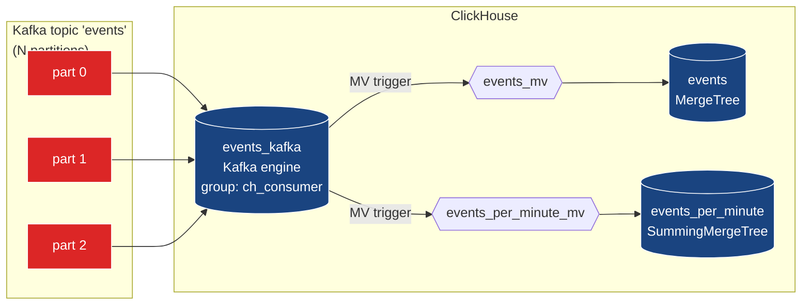
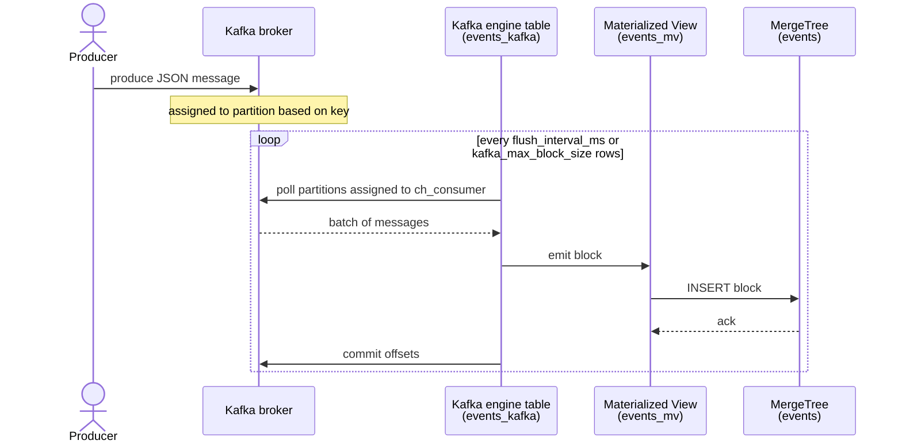

# Module 9 — Kafka Ingestion

> **Audience:** anyone wiring Kafka into ClickHouse. **Prerequisites:**
> Modules 1–2. **Time:** ~70 min reading + 30 min hands-on.

By the end you will be able to:

- Build the canonical `Kafka engine → MV → MergeTree` pipeline.
- Configure consumer groups, batching, and retries.
- Route bad messages to a Dead Letter Queue (DLQ).
- Achieve "exactly once" semantics over an at-least-once source.
- Reset offsets for replay; pause and resume consumption.
- Pick the right wire format (JSON, CSV, Avro, Protobuf).

---

## 1. The mental model

ClickHouse's Kafka engine is a **consumer**, not a destination. Selecting
from it consumes messages. To make ingest durable you put a Materialized
View on top of it that writes the consumed rows to a real MergeTree.



Three rules to remember:

1. **Don't `SELECT * FROM events_kafka`.** A direct SELECT consumes
   messages and throws them away. Use it only for diagnosis with `LIMIT 1`.
2. **The MV is the durability boundary.** If you DROP the MV without
   replacement, the engine still consumes — your data is gone.
3. **One Kafka source can feed N MVs.** A single read of the topic can
   power both the durable destination and any number of pre-aggregations.

---

## 2. The Kafka source table

```sql
CREATE TABLE events_kafka (
    event_time DateTime,
    user_id    UInt64,
    event_type String,
    revenue    Float64,
    payload    String
)
ENGINE = Kafka
SETTINGS
    kafka_broker_list   = 'm9-kafka:29092',
    kafka_topic_list    = 'events',
    kafka_group_name    = 'ch_consumer',
    kafka_format        = 'JSONEachRow',
    kafka_num_consumers = 1,
    kafka_max_block_size = 1048576;
```

Settings worth knowing:

| Setting                        | Default                | What it controls                                                            |
|--------------------------------|------------------------|-----------------------------------------------------------------------------|
| `kafka_broker_list`            | required                | Comma-separated `host:port`. Multiple brokers is fine.                      |
| `kafka_topic_list`             | required                | Comma-separated topics. Regex with `kafka_topic_regex`.                     |
| `kafka_group_name`             | required                | Consumer group ID. Multiple CH instances in the same group share partitions. |
| `kafka_format`                 | required                | `JSONEachRow`, `CSV`, `TabSeparated`, `Avro`, `AvroConfluent`, `Protobuf`, …  |
| `kafka_num_consumers`          | 1                       | Threads per topic per node.                                                 |
| `kafka_max_block_size`         | 1 048 576               | Rows the consumer batches before emitting one block.                         |
| `kafka_thread_per_consumer`    | 0                       | If 1, each consumer gets its own thread (useful >1 partition).              |
| `kafka_skip_broken_messages`   | 0                       | Skip N badly-formed messages per block; rest of the block proceeds.         |
| `kafka_handle_error_mode`      | `'default'`             | `'stream'` exposes `_error` / `_raw_message` virtual columns. See §5.        |
| `kafka_commit_every_batch`     | 0                       | Commit per batch instead of per block. Trades latency for granularity.       |
| `kafka_max_rows_per_message`   | 1                       | For some formats, multiple rows per message.                                 |

Server-level defaults live in `<kafka>` in the server config:

```xml
<kafka>
    <num_threads>2</num_threads>
    <flush_interval_ms>7500</flush_interval_ms>
    <flush_on_rows>10000</flush_on_rows>
    <max_retries>30</max_retries>
    <retry_backoff_ms>100</retry_backoff_ms>
</kafka>
```

---

## 3. The Materialized View glue

```sql
CREATE TABLE events (
    event_time  DateTime,
    user_id     UInt64,
    event_type  LowCardinality(String),
    revenue     Float64,
    payload     String,
    inserted_at DateTime DEFAULT now()
)
ENGINE = MergeTree
PARTITION BY toYYYYMMDD(event_time)
ORDER BY (event_type, event_time);

CREATE MATERIALIZED VIEW events_mv TO events AS
SELECT event_time, user_id, event_type, revenue, payload
FROM events_kafka;
```

The MV reads the Kafka source and writes to the destination. As long as
the MV exists, the engine consumes. Drop it (`DROP TABLE events_mv`) and
consumption stops; CH commits no further offsets.

### Multiple MVs from one source

```sql
CREATE TABLE events_per_minute (...) ENGINE = SummingMergeTree ORDER BY (...);

CREATE MATERIALIZED VIEW events_per_minute_mv TO events_per_minute AS
SELECT toStartOfMinute(event_time) AS minute,
       event_type,
       count() AS events,
       sum(revenue) AS revenue
FROM events_kafka
GROUP BY minute, event_type;
```

Both MVs run from the same Kafka read. Single network/IO, two writes.

---

## 4. The end-to-end flow



Failure semantics:

- **Server crash mid-block** — uncommitted messages are re-consumed on
  restart. `events` may have duplicates if the prior INSERT partially
  succeeded; deduplicate in the destination if it matters.
- **MV crash** — same as above; the MV's INSERT errored, so the offset
  isn't committed.
- **Bad message** — by default, the *whole block* fails. Enable
  `kafka_skip_broken_messages` or `kafka_handle_error_mode = 'stream'`.

---

## 5. Dead Letter Queue — `kafka_handle_error_mode = 'stream'`

The default mode poisons a block of *good* messages if any one of them
fails to parse. The `'stream'` mode lets bad messages flow with two extra
virtual columns:

| Virtual column | Type   | Contains                                                  |
|----------------|--------|-----------------------------------------------------------|
| `_error`       | String | Empty if the message parsed cleanly; an error string if not. |
| `_raw_message` | String | The raw bytes of the message.                             |
| `_topic`       | LowCardinality(String) | Topic name.                                |
| `_partition`   | UInt64 | Partition number.                                         |
| `_offset`      | UInt64 | Offset within the partition.                              |
| `_timestamp`   | Nullable(DateTime) | Producer timestamp.                            |

Then split with two MVs:

```sql
CREATE TABLE events_kafka_safe (
    event_time DateTime, user_id UInt64,
    event_type String, revenue Float64, payload String
)
ENGINE = Kafka
SETTINGS
    kafka_broker_list       = 'm9-kafka:29092',
    kafka_topic_list        = 'events',
    kafka_group_name        = 'ch_consumer_safe',
    kafka_format            = 'JSONEachRow',
    kafka_handle_error_mode = 'stream';

-- Good messages → durable destination
CREATE MATERIALIZED VIEW events_safe_mv TO events_safe AS
SELECT event_time, user_id, event_type, revenue, payload
FROM events_kafka_safe WHERE _error = '';

-- Bad messages → DLQ table for replay/inspection
CREATE TABLE events_dlq (
    received_at DateTime DEFAULT now(),
    error       String,
    raw         String,
    topic       String,
    partition   UInt32,
    offset      UInt64
) ENGINE = MergeTree ORDER BY (received_at, topic, partition);

CREATE MATERIALIZED VIEW events_dlq_mv TO events_dlq AS
SELECT now() AS received_at,
       _error AS error,
       _raw_message AS raw,
       _topic AS topic,
       _partition AS partition,
       _offset AS offset
FROM events_kafka_safe
WHERE _error != '';
```

Now produce a deliberately-broken message:

```bash
echo '{not valid json' | kafka-console-producer --bootstrap-server localhost:9092 --topic events
```

It lands in `events_dlq`, not in `events_safe`. Inspect, fix the
producer, optionally re-publish from the DLQ.

---

## 6. Exactly-once via `ReplacingMergeTree`

Kafka offers at-least-once delivery. After a failover or replay, you
might see the same message twice. To get **at-most-once at the table
level**, dedupe on a stable key with `ReplacingMergeTree`:

```sql
CREATE TABLE events_unique (
    event_time  DateTime,
    user_id     UInt64,
    event_type  LowCardinality(String),
    revenue     Float64,
    payload     String,
    ingested_at DateTime DEFAULT now()    -- the version
)
ENGINE = ReplacingMergeTree(ingested_at)
ORDER BY (user_id, event_time);

CREATE MATERIALIZED VIEW events_unique_mv TO events_unique AS
SELECT event_time, user_id, event_type, revenue, payload, now() AS ingested_at
FROM events_kafka;

-- Read with FINAL or argMax to see only the latest version per key.
SELECT count() FROM events_unique FINAL;
```

The dedup key `(user_id, event_time)` must be **stable across retries**
— typically the producer's natural primary key.

| Mode               | Throughput  | Correctness                                         |
|--------------------|-------------|-----------------------------------------------------|
| Plain MergeTree    | highest     | duplicates possible after failure                   |
| ReplacingMergeTree | high        | dedup on read (`FINAL`) or post-merge               |
| AggregatingMergeTree + idempotent agg | high | duplicates absorbed by the aggregator     |

---

## 7. Format coverage

`JSONEachRow` is the demo's choice. CH supports many more:

| Format          | Schema     | Notes                                                              |
|-----------------|------------|--------------------------------------------------------------------|
| `JSONEachRow`   | implicit   | One JSON object per line. Most flexible; modest overhead.          |
| `JSON`          | implicit   | Single big JSON blob with `data: [...]`. Less common in Kafka.     |
| `CSV` / `CSVWithNames` | implicit (or header) | Fast; no nesting.                                       |
| `TabSeparated`  | implicit   | Even faster; no quoting needed.                                    |
| `Protobuf`      | required   | `format_schema = 'events.proto:EventMessage'`. Compact, typed.     |
| `Avro`          | embedded   | One schema per message header.                                     |
| `AvroConfluent` | registry   | Confluent Schema Registry magic byte + ID.                         |
| `Parquet`       | embedded   | Often used for batch ingest, less for streaming.                   |

Schema-bound formats need the schema mounted under
`/var/lib/clickhouse/format_schemas/`:

```sql
CREATE TABLE events_kafka_proto (
    ...
)
ENGINE = Kafka
SETTINGS
    kafka_format = 'Protobuf',
    format_schema = 'events.proto:EventMessage',
    ...;
```

---

## 8. Operational SQL cheatsheet

```sql
-- Lag and assignments
SELECT
    database, table, consumer_id,
    assignments.topic AS topic,
    assignments.partition_id AS partition,
    assignments.current_offset AS offset
FROM system.kafka_consumers
ARRAY JOIN assignments
WHERE database = 'm9';

-- Lifetime counters
SELECT event, value
FROM system.events
WHERE event LIKE 'Kafka%'
ORDER BY event;

-- Pause / resume consumption (without dropping the MV)
DETACH TABLE events_mv;     -- consumer keeps running but doesn't write
ATTACH TABLE events_mv;     -- resume; offsets resume from where Kafka committed

-- Hard reset offsets (replay everything)
docker exec m9-kafka kafka-consumer-groups \
    --bootstrap-server localhost:9092 \
    --group ch_consumer --reset-offsets --to-earliest \
    --topic events --execute

-- Per-consumer-group lag
docker exec m9-kafka kafka-consumer-groups \
    --bootstrap-server localhost:9092 \
    --group ch_consumer --describe
```

---

## 9. The hands-on demo

### What you get

```
docker-compose.yml          m9-clickhouse + m9-kafka + m9-zk + m9-kafka-ui
configs/clickhouse-config.xml
setup.sql · extras.sql · queries.sql
produce.py                  JSON-line producer (pure stdlib)
up.sh · run.sh · down.sh
```

### Container map

| Service     | Container       | Host ports                    |
|-------------|-----------------|-------------------------------|
| ClickHouse  | `m9-clickhouse` | 8123, 9000                    |
| Kafka       | `m9-kafka`      | 9092 (host), 29092 (internal) |
| ZooKeeper   | `m9-zk`         | (internal only)               |
| Kafka UI    | `m9-kafka-ui`   | 8080                          |

Internally the broker is `m9-kafka:29092` (used in `setup.sql`). From
the host: `localhost:9092`.

### Execution flow — what runs, in order

| #  | Step                                   | What happens                                                                                                                                                                                                                                                                                                                |
|----|----------------------------------------|-----------------------------------------------------------------------------------------------------------------------------------------------------------------------------------------------------------------------------------------------------------------------------------------------------------------------------|
| 0  | self-bootstrap                         | `up.sh` brings up the 4-container stack and waits until `m9-clickhouse:/ping` and `m9-kafka:9092` both answer.                                                                                                                                                                                                              |
| 1  | Create `events` topic                  | `kafka-topics --create --if-not-exists --topic events --partitions 3 --replication-factor 1`.                                                                                                                                                                                                                              |
| 2  | `setup.sql`                            | Creates database `m9` and the canonical pipeline: `events_kafka` (Kafka engine, JSONEachRow, group `ch_consumer`), `events` (durable MergeTree), `events_mv` (MV moves rows from Kafka → events), `events_per_minute` (SummingMergeTree), `events_per_minute_mv` (minute-bucket aggregation). One Kafka read serves both MVs. |
| 3  | `extras.sql`                           | Adds the **DLQ pipeline**: `events_kafka_safe` with `kafka_handle_error_mode = 'stream'` (group `ch_consumer_safe`); two MVs split it on `_error == ''` → `events_safe`, `_error != ''` → `events_dlq` (with topic / partition / offset preserved). Also creates `events_unique` (ReplacingMergeTree on `(user_id, event_time)`) and `events_unique_mv`. |
| 4  | Produce **valid** messages             | `python3 produce.py --rows $ROWS` (default 100k) → piped into `kafka-console-producer --topic events`.                                                                                                                                                                                                                     |
| 5  | Produce **broken** messages            | 50 deliberately malformed JSON lines → `kafka-console-producer --topic events`. These get rejected by the strict consumer (`events_kafka`) but flow through the safe consumer into `events_dlq`.                                                                                                                            |
| 6  | Sleep 8 s                              | Lets the Kafka MVs catch up (default `flush_interval_ms = 7500`).                                                                                                                                                                                                                                                          |
| 7  | `queries.sql`                          | Inspects: total rows in `events`, per-event-type breakdown, the SummingMergeTree minute buckets, `system.kafka_consumers` (assignments, offsets), `system.events` Kafka counters.                                                                                                                                          |
| 8  | DLQ + exactly-once verification        | Prints `events_dlq` count (~50, the bad messages), `events_safe` count (~`$ROWS`), `events_unique FINAL` count, top-3 `_error` strings.                                                                                                                                                                                  |

Run with bigger volume:

```bash
ROWS=500000 ./run.sh
```

---

## 10. Common pitfalls

| Symptom                                                                  | Cause                                                                            | Fix                                                                                                |
|--------------------------------------------------------------------------|----------------------------------------------------------------------------------|----------------------------------------------------------------------------------------------------|
| `SELECT * FROM events_kafka` returns rows once and never again           | Direct SELECT consumes messages.                                                  | Don't. Use the MV. For diagnostics: `SELECT * FROM events_kafka LIMIT 1`.                          |
| MV creates millions of tiny parts                                        | Tiny `kafka_max_block_size` and high message rate.                                | Raise to `1048576` rows or `64 * 1024 * 1024` bytes. Match `flush_on_rows` server setting.         |
| One bad message stops ingestion                                          | Default `kafka_handle_error_mode = 'default'`.                                    | `kafka_skip_broken_messages = N` for tolerance, or DLQ pattern.                                    |
| Duplicates after Kafka rebalance                                         | Kafka redelivered uncommitted messages.                                            | Use `ReplacingMergeTree` on a stable key, or AggregatingMergeTree with idempotent aggregates.       |
| "Cannot resolve hostname m9-kafka"                                       | `kafka_broker_list` uses internal hostname; CH can't reach it from host network.   | Use the hostname that's reachable from CH (the demo uses `m9-kafka:29092` on the shared network).  |
| Lag grows unbounded                                                      | Single consumer can't keep up with topic throughput.                              | Increase `kafka_num_consumers`, or scale CH replicas in the same group.                            |
| Consumer group resets every restart                                      | Group ID changes (e.g. random suffix).                                            | Use a stable `kafka_group_name`. Treat it like a database name.                                    |
| Offsets stuck on a corrupted message                                     | The block keeps failing; CH retries forever.                                       | Skip the offset via the kafka CLI tools, or switch to `'stream'` mode + DLQ.                       |

---

## 11. Tuning knobs by goal

| Goal                                  | Knobs                                                                                       |
|---------------------------------------|---------------------------------------------------------------------------------------------|
| Throughput                            | `kafka_num_consumers`↑, `kafka_max_block_size`↑, multiple CH replicas in same group         |
| Latency                               | `flush_interval_ms`↓, `flush_on_rows`↓, `kafka_max_block_size`↓                              |
| Tolerance to bad messages             | `kafka_handle_error_mode = 'stream'` + DLQ MV                                                |
| RPO=0 (no message loss)               | producer `acks=all` + `kafka_commit_every_batch=1` + dedup on consumer                       |
| Smaller storage footprint             | `events.payload` with `CODEC(ZSTD)`, partition by day, drop column-level TTL                |

---

## 12. Talking points for the live session

1. **Kafka engine is a *consumer*, not a destination.** Demonstrate by
   `SELECT * FROM events_kafka LIMIT 5` and watching messages disappear.
2. **MV is the durability boundary.** Drop the MV, produce more
   messages, show that they're consumed and discarded.
3. **DLQ in 30 seconds.** Show drill 5 (broken JSON) and the
   `events_dlq` table.
4. **Exactly-once is a property of the destination,** not the source.
   `ReplacingMergeTree` is how CH gets there.
5. **Schema-bound formats** (Protobuf/Avro) for production. Mention
   `format_schema_path` and the AvroConfluent magic byte.
6. **Operational ergonomics:** `system.kafka_consumers`, kafka-cli
   group-describe, DETACH/ATTACH MV for pause/resume.

---

## 13. Going deeper

- **Module 2** — the engines this module writes into.
- **Module 6** — query optimisation for the high-volume `events` table.
- ClickHouse docs: <https://clickhouse.com/docs/en/integrations/kafka>
- Confluent's "Kafka Connect ClickHouse Sink" for the *opposite*
  direction (CH → Kafka).
